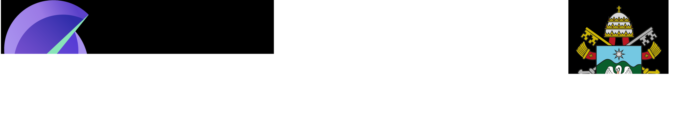

# Plantão Pet

> Plataforma de matchmaking entre donos de pets e cuidadores de animais, com agendamento de serviços, comunicação assíncrona via Apache Kafka e notificações em tempo real via WebSocket.


---

## Sobre o projeto

O **Plantão Pet** conecta donos de pets a cuidadores de animais. O dono cadastra seus pets, abre uma solicitação de serviço (passeio, visita domiciliar ou hospedagem) e aguarda que um cuidador disponível aceite. Todo o ciclo de vida da solicitação — criação, aceitação, início, conclusão e avaliação — é processado de forma assíncrona via Apache Kafka, com notificações entregues em tempo real aos apps Flutter via Socket.IO.

O sistema é composto por três módulos integrados:

| Módulo | Tecnologia | Descrição |
|---|---|---|
| `backend/` | Node.js + Express | API REST, banco de dados, mensageria e WebSocket |
| `mobile/` (Owner) | Flutter | App do dono do pet |
| `mobile/` (Caregiver) | Flutter | App do cuidador |

---

## Arquitetura

O backend adota uma **arquitetura orientada a eventos**. A API REST recebe as requisições dos apps, executa a lógica de negócio e publica eventos de domínio no Kafka. Um consumer dedicado escuta esses eventos e os entrega em tempo real via Socket.IO para os dispositivos conectados.

```
┌────────────────────────────────────────────────┐
│              Apps Flutter (iOS / Android)       │
│        App Dono  ·  App Cuidador               │
└───────────────┬────────────────┬───────────────┘
                │  REST HTTP     │  WebSocket (Socket.IO)
┌───────────────▼────────────────▼───────────────┐
│               Backend (Node.js)                │
│   Routes → Controllers → Services → Repos      │
│                   │ Kafka Producer              │
└───────────────────┼────────────────────────────┘
                    │
┌───────────────────▼────────────────────────────┐
│            Apache Kafka (KRaft)                │
│  service_request.*  ·  service.completed       │
│  review.created     ·  service_request.expired │
└───────────────────┬────────────────────────────┘
                    │ Consumer → Socket.IO emit
┌───────────────────▼────────────────────────────┐
│           PostgreSQL 15  (via Prisma)          │
└────────────────────────────────────────────────┘
```

---

## Fluxo principal

```
Dono abre solicitação  →  Kafka publica evento  →  Cuidadores recebem via WebSocket
Cuidador aceita        →  Kafka publica evento  →  Dono é notificado em tempo real
Cuidador inicia        →  Dono acompanha status no app
Cuidador conclui       →  Dono recebe notificação + pode avaliar o cuidador
```

---

## Início rápido

### Pré-requisitos

- Docker + Docker Compose
- Flutter SDK 3.7+ (para o app mobile)

### Backend

```bash
cd backend
cp .env.example .env        # configure as variáveis de ambiente
docker compose up -d        # sobe postgres, kafka, kafka-ui e a api
```

Acesse:
- API: `http://localhost:3000`
- Swagger: `http://localhost:3000/api-docs`
- Kafka UI: `http://localhost:8080`

### App mobile (Dono do Pet)

```bash
cd mobile
cp .env.example .env        # ajuste a URL da API se necessário
flutter pub get
flutter run --dart-define-from-file=.env
```

---

## Estrutura do repositório

```
plantao-pet-system/
├── backend/       ← API REST + Kafka + Socket.IO
├── mobile/        ← App Flutter (Dono e Cuidador)
└── docs/          ← Documentação técnica detalhada
```

---

## Documentação

| Documento | Descrição |
|---|---|
| [Backend — API REST](docs/backend-api.md) | Endpoints, regras de negócio, Kafka, Docker e variáveis de ambiente |
| [App do Dono do Pet](docs/mobile-owner-app.md) | Telas, navegação, providers, segurança e configuração do app Flutter |
| [Integração com MOM (Kafka)](docs/integracao_Mom.md) | Fluxo completo de eventos e integração Kafka ↔ Socket.IO |

---

## Vídeo de apresentação

> **Para avaliação do fluxo de mensagens:**

### [Assistir Vídeo de Apresentação do fluxo de mensageria](https://drive.google.com/file/d/12Vf2aGwrp9X9751zxPZRw6eRGAjnw2HE/view?usp=sharing)

### [Assistir Vídeo de Apresentação do fluxo de dono do pet no aplicativo móvel](https://drive.google.com/file/d/1ga2dp3g4hluzhwW6VxaMzs27TPWKo6Uh/view?usp=share_link)

---

<div align="center">
  
</div>
<p align="center">Fonte do banner: <a href="https://github.com/joaopauloaramuni">João Paulo Carneiro Aramuni</a></p>
