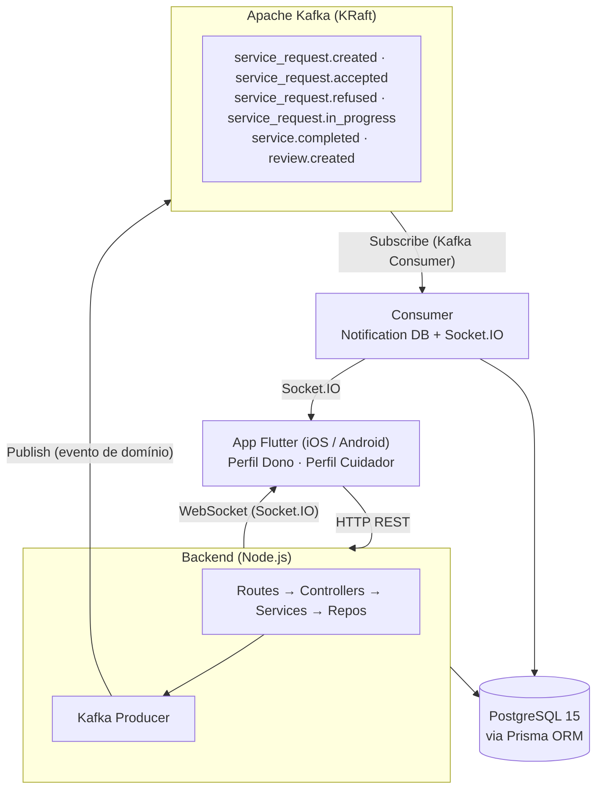
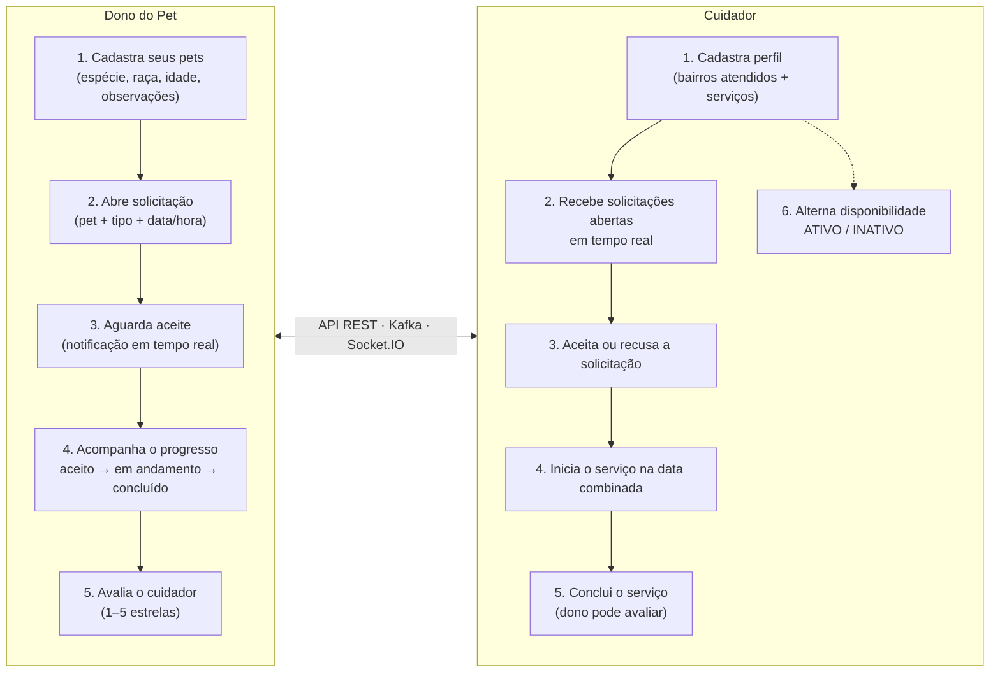

# Plantão Pet

> Plataforma de matchmaking que conecta **donos de pets** a **cuidadores de animais**, com agendamento de serviços, comunicação assíncrona via Apache Kafka e notificações em tempo real via WebSocket.


---

## O que é o Plantão Pet?

O **Plantão Pet** resolve um problema prático: donos de pets precisam de cuidadores confiáveis para passear, visitar ou hospedar seus animais, e cuidadores precisam de uma forma organizada de encontrar e gerenciar esses serviços.

A plataforma funciona como um marketplace de serviços veterinários domiciliares. O **dono do pet** abre uma solicitação descrevendo o serviço desejado (tipo, data, endereço, qual pet), e os **cuidadores disponíveis** recebem essa solicitação em tempo real via WebSocket. O primeiro cuidador a aceitar assume o atendimento. O ciclo completo — criação, aceitação, início, conclusão e avaliação — é coordenado de forma assíncrona via Apache Kafka.

---

## Os dois perfis do sistema

| Perfil | Responsabilidades |
|---|---|
| **Dono do Pet** | Cadastra seus pets, abre solicitações de serviço, acompanha o status em tempo real, avalia o cuidador após o serviço |
| **Cuidador** | Visualiza solicitações abertas, aceita ou recusa atendimentos, gerencia a fila de serviços em andamento, controla sua disponibilidade (ATIVO/INATIVO) |

---

## Módulos do sistema

| Módulo | Tecnologia | Responsabilidade |
|---|---|---|
| `backend/` | Node.js + Express | API REST, banco de dados, mensageria Kafka e WebSocket |
| `mobile/` | Flutter (único app) | Interface do **Dono do Pet** e do **Cuidador** — o papel do usuário é determinado no cadastro/login |

---

## Arquitetura

O backend utiliza uma **arquitetura orientada a eventos (Event-Driven Architecture)**. Toda mudança de estado relevante — aceitação, início ou conclusão de um serviço — é publicada no Kafka. Um consumer dedicado consome esses eventos e os entrega via Socket.IO para os clientes Flutter conectados, sem que o código de negócio precise saber quem vai receber a mensagem.



**Por que Kafka?** Em vez de o backend chamar diretamente "envie uma notificação para o dono", ele publica um evento `service_request.accepted`. O consumer Kafka, completamente independente, consome esse evento, grava a notificação no banco e a envia via Socket.IO. Isso desacopla a lógica de negócio da entrega de notificações.

---

## Fluxo principal — visão geral



---

## Início rápido

### Pré-requisitos

- Docker e Docker Compose instalados
- Flutter SDK 3.7+ (para o app mobile)

### 1. Backend

```bash
# Entre na pasta do backend
cd backend

# Crie o arquivo de variáveis de ambiente a partir do template
cp .env.example .env
# Edite o .env com sua configuração (banco, JWT_SECRET, etc.)

# Suba todos os serviços: PostgreSQL, Kafka, Kafka UI e a API
docker compose up -d

# Verifique se todos os containers estão rodando
docker compose ps
```

Após subir, os seguintes endereços estarão disponíveis:

| Serviço | URL |
|---|---|
| API REST | `http://localhost:3000` |
| Documentação Swagger | `http://localhost:3000/api-docs` |
| Kafka UI | `http://localhost:8080` |

### 2. App Mobile (um simulador)

```bash
# Entre na pasta do mobile
cd mobile

# Crie o arquivo de variáveis de ambiente
cp .env.example .env
# Ajuste BASE_URL e SOCKET_URL se necessário (padrão: http://localhost:3000)

# Instale as dependências Flutter
flutter pub get

# Execute o app no dispositivo/emulador conectado
flutter run --dart-define-from-file=.env
```

> **iOS Simulator:** mantenha `BASE_URL=http://localhost:3000`
> **Android Emulator:** use `BASE_URL=http://10.0.2.2:3000`

---

### 3. Testando com dois simuladores (Dono + Cuidador)

Para testar o fluxo completo — um usuário como Dono e outro como Cuidador — é necessário rodar o app em **dois simuladores simultaneamente**, cada um em seu próprio terminal.

#### Passo 1 — Verificar os simuladores disponíveis

```bash
# Listar todos os simuladores iOS instalados
xcrun simctl list devices available
```

Exemplo de saída:
```
iPhone 17
iPhone 17 Pro
iPhone 17 Pro Max
iPhone 16
```

#### Passo 2 — Abrir os simuladores

**Via Terminal:**
```bash
# Abrir o Simulator (já abre o último usado)
open -a Simulator

# Se precisar inicializar um modelo específico manualmente:
xcrun simctl boot "iPhone 17 Pro"
open -a Simulator
```

**Via Xcode:**
1. Abra o Xcode
2. Menu **Xcode → Open Developer Tool → Simulator**
3. Com o Simulator aberto: menu **File → Open Simulator** → escolha o modelo

#### Passo 3 — Confirmar que o Flutter enxerga os dois dispositivos

```bash
cd mobile
flutter devices
```

Saída esperada (exemplo real):
```
Found 4 connected devices:
  iPhone 17 Pro (mobile) • 2D22ACC7-4CC6-48A4-8432-010F8578099B • ios • com.apple.CoreSimulator.SimRuntime.iOS-26-5
  iPhone 17 (mobile)     • DE4CF79D-444A-4F30-9C51-FE875EB2B486 • ios • com.apple.CoreSimulator.SimRuntime.iOS-26-5
  macOS (desktop)        • macos                                 • darwin-arm64
  Chrome (web)           • chrome                                • web-javascript
```

#### Passo 4 — Rodar o app nos dois simuladores (terminais separados)

**Terminal 1 — Dono do Pet (iPhone 17):**
```bash
cd ~/Developer/plantao-pet-system/mobile
flutter run -d "iPhone 17" --dart-define-from-file=.env
```

**Terminal 2 — Cuidador (iPhone 17 Pro):**
```bash
cd ~/Developer/plantao-pet-system/mobile
flutter run -d "iPhone 17 Pro" --dart-define-from-file=.env
```

Você também pode usar o UUID diretamente (mais preciso):
```bash
# Terminal 1 — Dono
flutter run -d DE4CF79D-444A-4F30-9C51-FE875EB2B486 --dart-define-from-file=.env

# Terminal 2 — Cuidador
flutter run -d 2D22ACC7-4CC6-48A4-8432-010F8578099B --dart-define-from-file=.env
```

#### Resultado esperado

| Simulador | Perfil | O que testar |
|---|---|---|
| iPhone 17 | Dono do Pet | Cadastrar pet → abrir solicitação → acompanhar status → avaliar |
| iPhone 17 Pro | Cuidador | Receber solicitação em tempo real → aceitar → iniciar → concluir |

As notificações Socket.IO fluem em tempo real entre os dois: quando o Cuidador aceitar no iPhone 17 Pro, o Dono verá o status atualizar automaticamente no iPhone 17.

---

## Estrutura do repositório

```
plantao-pet-system/
├── backend/              ← API REST, Kafka, Socket.IO, banco de dados
│   ├── src/              ← Código-fonte (routes, controllers, services, repos...)
│   ├── prisma/           ← Schema do banco e migrations
│   ├── docker-compose.yml
│   └── .env.example      ← Template de variáveis de ambiente
│
├── mobile/               ← App Flutter (Dono e Cuidador no mesmo app)
│   ├── lib/              ← Código-fonte Dart
│   └── .env.example      ← Template de URLs
│
└── docs/                 ← Documentação técnica detalhada
    ├── backend-api.md
    ├── mobile-owner-app.md
    ├── mobile-caregiver-app.md
    └── integracao_Mom.md
```

---

## Documentação

| Documento | O que você vai encontrar |
|---|---|
| [Backend — API REST](docs/backend-api.md) | Arquitetura em camadas, todos os endpoints, modelo de dados, regras de negócio, variáveis de ambiente |
| [App Mobile — Dono do Pet](docs/mobile-owner-app.md) | Telas do Dono (home, pets, cuidadores, solicitações, avaliação), providers, repositórios, Socket.IO |
| [App Mobile — Cuidador](docs/mobile-caregiver-app.md) | Telas do Cuidador (solicitações abertas, atendimentos, perfil, status), providers, repositórios, Socket.IO |
| [Integração com Kafka (MOM)](docs/integracao_Mom.md) | Comunicação assíncrona, tópicos, payloads, integração Socket.IO, deduplicação |

---

## Vídeos de apresentação

| Vídeo | Conteúdo |
|---|---|
| [Fluxo de mensageria Kafka](https://drive.google.com/file/d/12Vf2aGwrp9X9751zxPZRw6eRGAjnw2HE/view?usp=sharing) | Demonstração dos eventos publicados e consumidos pelo Kafka em tempo real |
| [Fluxo do Dono do Pet no app](https://drive.google.com/file/d/1ga2dp3g4hluzhwW6VxaMzs27TPWKo6Uh/view?usp=share_link) | Ciclo completo: cadastro de pet → solicitação → acompanhamento → avaliação |

---

<div align="center">
  
</div>
<p align="center">Fonte do banner: <a href="https://github.com/joaopauloaramuni">João Paulo Carneiro Aramuni</a></p>
