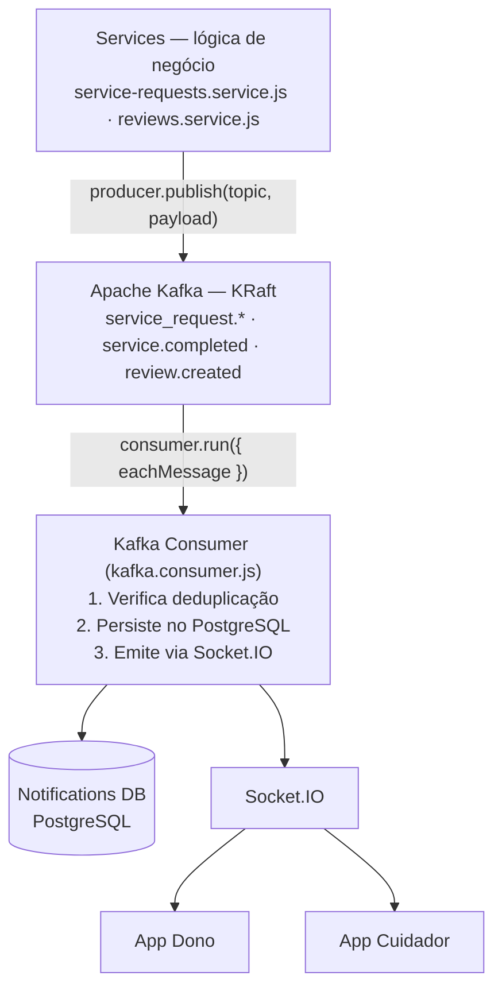
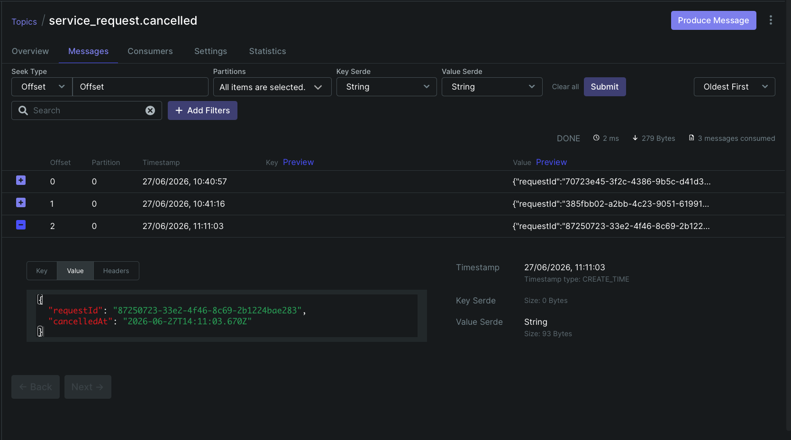
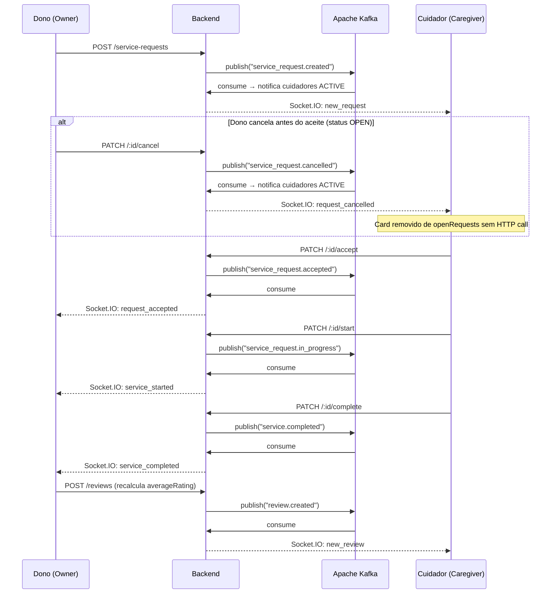

# Integração com MOM — Apache Kafka

> Documentação da comunicação assíncrona do **Plantão Pet** via Apache Kafka e sua integração com Socket.IO para entrega de notificações em tempo real.

---

## Sumário

- [O que é MOM e por que usamos Kafka](#o-que-é-mom-e-por-que-usamos-kafka)
- [Visão geral da arquitetura assíncrona](#visão-geral-da-arquitetura-assíncrona)
- [Configuração do Kafka](#configuração-do-kafka)
- [Tópicos e eventos](#tópicos-e-eventos)
- [Fluxo completo ponta a ponta](#fluxo-completo-ponta-a-ponta)
- [Integração com Socket.IO](#integração-com-socketio)
- [Persistência e deduplicação de notificações](#persistência-e-deduplicação-de-notificações)
- [Desafios de implementação](#desafios-de-implementação)
- [Evidências de funcionamento](#evidências-de-funcionamento)

---

## O que é MOM e por que usamos Kafka

**MOM (Message-Oriented Middleware)** é um padrão de comunicação em que componentes de software trocam informações por meio de mensagens enviadas a um intermediário (broker), em vez de chamadas diretas entre si. Isso desacopla quem produz a informação de quem a consome.

No Plantão Pet, quando um cuidador conclui um serviço, o backend precisa:
1. Salvar o novo status no banco de dados
2. Gravar uma notificação para o dono
3. Enviar essa notificação via WebSocket para o app do dono em tempo real

Em vez de fazer tudo isso sequencialmente no mesmo código que processa o `PATCH /complete`, o backend **publica um evento no Kafka** (`service.completed`) e segue em frente. O consumer Kafka, rodando de forma independente, recebe esse evento, grava a notificação e emite via Socket.IO — sem que o código de negócio precise saber qualquer detalhe dessa entrega.

**Por que Kafka especificamente?**

| Critério | Kafka | Alternativas (RabbitMQ, Redis Pub/Sub) |
|---|---|---|
| **Persistência** | Armazena mensagens em disco por período configurável — permite reprocessamento após falhas | Mensagens geralmente perdidas após consumo |
| **Replay** | Consumer pode reprocessar histórico com `fromBeginning: true` | Não disponível nativamente |
| **Escalabilidade** | Particionamento horizontal nativo para múltiplos consumers | Limitado |
| **Durabilidade** | Mensagens sobrevivem a reinicializações do broker | Depende da configuração |

---

## Visão geral da arquitetura assíncrona



**Ponto-chave:** não existe nenhuma chamada REST direta do consumer para os services. A única comunicação é via tópicos Kafka. O consumer e o producer são módulos completamente independentes.

---

## Configuração do Kafka

| Configuração | Valor | Onde definir |
|---|---|---|
| Broker | `localhost:9092` (local) / `kafka:29092` (Docker) | `.env` → `KAFKA_BROKER` |
| Modo | KRaft (sem Zookeeper) | `docker-compose.yml` |
| Client ID | `plantao-pet-api` | `kafka.client.js` |
| Consumer Group | `plantao-pet-group` | `kafka.consumer.js` |
| Serialização | JSON como string | Padrão da implementação |

**Singleton do producer:** o producer é instanciado uma única vez e reutilizado em toda a aplicação. Uma flag `connected` evita múltiplas chamadas a `connect()`.

**Retry do consumer:** na inicialização, o consumer tenta se inscrever nos tópicos em loop com delay de 3 segundos, aguardando o Kafka estar disponível — necessário especialmente no boot do Docker.

---

## Tópicos e eventos

O sistema utiliza 7 tópicos, cada um correspondendo a um evento de domínio específico do ciclo de vida de uma solicitação.

### Tabela consolidada dos eventos

| Tópico / Fila | Produtor | Consumidor | Principais campos do payload | Evento Socket.IO | Destinatário |
|---|---|---|---|---|---|
| `service_request.created` | `ServiceRequestService.create()` | `NotificationConsumer` | `requestId`, `serviceType`, `scheduledAt`, `petName`, `meetingAddress` | `new_request` | Todos os cuidadores `ACTIVE` |
| `service_request.accepted` | `ServiceRequestService.accept()` | `NotificationConsumer` | `requestId`, `caregiverName`, `caregiverPhone`, `ownerId` | `request_accepted` | Dono da solicitação |
| `service_request.refused` | `ServiceRequestService.refuse()` | `NotificationConsumer` | `requestId`, `caregiverId`, `refusedAt`, `ownerId` | `request_refused` | Dono da solicitação |
| `service_request.cancelled` | `ServiceRequestService.cancel()` | `NotificationConsumer` | `requestId`, `cancelledAt` | `request_cancelled` | Todos os cuidadores `ACTIVE` |
| `service_request.in_progress` | `ServiceRequestService.start()` | `NotificationConsumer` | `requestId`, `startedAt`, `ownerId` | `service_started` | Dono da solicitação |
| `service.completed` | `ServiceRequestService.complete()` | `NotificationConsumer` | `requestId`, `completedAt`, `caregiverId`, `ownerId` | `service_completed` | Dono da solicitação |
| `review.created` | `ReviewService.create()` | `NotificationConsumer` | `caregiverId`, `averageRating`, `comment`, `requestId` | `new_review` | Cuidador avaliado |

Os payloads JSON completos de cada evento estão detalhados nas seções abaixo.

---

### `service_request.created`

**Publicado por:** `service-requests.service.js` → método `create()`
**Quando:** dono cria uma nova solicitação de serviço

**Payload:**
```json
{
  "requestId": "2306bc83-9a50-4acc-acbe-84d29adeb3a0",
  "serviceType": "WALK_30MIN",
  "scheduledAt": "2026-05-17T10:00:00.000Z",
  "petName": "Rex",
  "meetingAddress": "Rua das Flores, 123, Centro"
}
```

**Consumer — o que acontece:**
1. Busca todos os cuidadores com status `ACTIVE` no banco
2. Para cada cuidador: verifica deduplicação, grava notificação, emite via Socket.IO

**Evento Socket.IO emitido:** `new_request`
**Destinatário:** todos os cuidadores `ACTIVE` conectados (sala `caregiver:<id>` de cada um)

**Evidência no Kafka UI:**


---

### `service_request.accepted`

**Publicado por:** `service-requests.service.js` → método `accept()`
**Quando:** cuidador aceita uma solicitação

**Payload:**
```json
{
  "requestId": "2306bc83-9a50-4acc-acbe-84d29adeb3a0",
  "caregiverName": "Maria Cuidadora",
  "caregiverPhone": "31988880000",
  "ownerId": "e5c93a04-575a-4d0b-a6f7-cef76e908691"
}
```

**Consumer — o que acontece:**
1. Verifica deduplicação para o dono
2. Grava notificação com `userId = ownerId`
3. Emite evento Socket.IO para o dono

**Evento Socket.IO emitido:** `request_accepted`
**Destinatário:** dono da solicitação (sala `owner:<ownerId>`)

**Evidência no Kafka UI:**


---

### `service_request.cancelled`

**Publicado por:** `service-requests.service.js` → método `cancel()`
**Quando:** dono cancela uma solicitação com status `OPEN`

**Payload:**
```json
{
  "requestId": "87250723-33e2-4f46-8c69-2b1224bae283",
  "cancelledAt": "2026-06-27T14:11:03.670Z"
}
```

**Consumer — o que acontece:**
1. Busca todos os cuidadores com status `ACTIVE` no banco
2. Para cada cuidador: verifica deduplicação, grava notificação com `{ requestId }`, emite via Socket.IO

**Evento Socket.IO emitido:** `request_cancelled`
**Destinatário:** todos os cuidadores `ACTIVE` conectados

No app do Cuidador, este evento remove a solicitação diretamente de `openRequests` sem precisar refazer a requisição HTTP — a lista atualiza imediatamente ao receber o payload com `requestId`.

**Evidência no Kafka UI:**



---

### `service_request.refused`

**Publicado por:** `service-requests.service.js` → método `refuse()`
**Quando:** cuidador recusa uma solicitação aceita (status volta para `OPEN`)

**Payload:**
```json
{
  "requestId": "2306bc83-9a50-4acc-acbe-84d29adeb3a0",
  "caregiverId": "dcc4f2ca-a9e8-4bfc-9662-1a268d8dc422",
  "refusedAt": "2026-05-16T12:42:39.736Z",
  "ownerId": "e5c93a04-575a-4d0b-a6f7-cef76e908691"
}
```

**Evento Socket.IO emitido:** `request_refused`
**Destinatário:** dono da solicitação

**Evidência no Kafka UI:**


---

### `service_request.in_progress`

**Publicado por:** `service-requests.service.js` → método `start()`
**Quando:** cuidador inicia o atendimento

**Payload:**
```json
{
  "requestId": "2306bc83-9a50-4acc-acbe-84d29adeb3a0",
  "startedAt": "2026-05-16T12:43:46.014Z",
  "ownerId": "e5c93a04-575a-4d0b-a6f7-cef76e908691"
}
```

**Evento Socket.IO emitido:** `service_started`
**Destinatário:** dono da solicitação

**Evidência no Kafka UI:**


---

### `service.completed`

**Publicado por:** `service-requests.service.js` → método `complete()`
**Quando:** cuidador conclui o serviço

**Payload:**
```json
{
  "requestId": "2306bc83-9a50-4acc-acbe-84d29adeb3a0",
  "completedAt": "2026-05-16T12:44:54.552Z",
  "caregiverId": "dcc4f2ca-a9e8-4bfc-9662-1a268d8dc422",
  "ownerId": "e5c93a04-575a-4d0b-a6f7-cef76e908691"
}
```

**Evento Socket.IO emitido:** `service_completed`
**Destinatário:** dono da solicitação

No app, este evento habilita o botão de avaliação do cuidador.

**Evidência no Kafka UI:**


---

### `review.created`

**Publicado por:** `reviews.service.js` → método `create()`
**Quando:** dono avalia o cuidador após a conclusão do serviço

**Payload:**
```json
{
  "caregiverId": "dcc4f2ca-a9e8-4bfc-9662-1a268d8dc422",
  "averageRating": 5,
  "comment": "Excelente cuidador, muito atencioso com o Rex!",
  "requestId": "2306bc83-9a50-4acc-acbe-84d29adeb3a0"
}
```

**Evento Socket.IO emitido:** `new_review`
**Destinatário:** cuidador avaliado (sala `caregiver:<caregiverId>`)

O campo `averageRating` já reflete a nova média calculada após esta avaliação.

**Evidência no Kafka UI:**


---

## Fluxo completo ponta a ponta

O diagrama abaixo mostra todo o ciclo de uma solicitação, da criação à avaliação, com os eventos Kafka que fluem em cada etapa.



**Logs de console registrados durante o fluxo completo (16/05/2026):**

```
[KAFKA SEND] Evento publicado no tópico "service_request.created"
[KAFKA RECV] Recebido [service_request.created] - ID: 2306bc83-9a50-4acc-acbe-84d29adeb3a0

[KAFKA SEND] Evento publicado no tópico "service_request.accepted"
[KAFKA RECV] Recebido [service_request.accepted] - ID: 2306bc83-9a50-4acc-acbe-84d29adeb3a0

[KAFKA SEND] Evento publicado no tópico "service_request.refused"
[KAFKA RECV] Recebido [service_request.refused] - ID: 2306bc83-9a50-4acc-acbe-84d29adeb3a0

[KAFKA SEND] Evento publicado no tópico "service_request.cancelled"
[KAFKA RECV] Recebido [service_request.cancelled] - ID: 87250723-33e2-4f46-8c69-2b1224bae283

[KAFKA SEND] Evento publicado no tópico "service_request.in_progress"
[KAFKA RECV] Recebido [service_request.in_progress] - ID: 2306bc83-9a50-4acc-acbe-84d29adeb3a0
payload: { requestId: '2306bc83...', startedAt: '2026-05-16T12:43:46.014Z', ownerId: 'e5c93a04...' }

[KAFKA SEND] Evento publicado no tópico "service.completed"
[KAFKA RECV] Recebido [service.completed]
payload: { requestId: '2306bc83...', completedAt: '2026-05-16T12:44:54.552Z', caregiverId: 'dcc4f2ca...', ownerId: 'e5c93a04...' }

[KAFKA SEND] Evento publicado no tópico "review.created"
[KAFKA RECV] Recebido [review.created]
payload: { caregiverId: 'dcc4f2ca...', averageRating: 5, comment: 'Excelente cuidador, muito atencioso com o Rex!', requestId: '2306bc83...' }
```

---

## Integração com Socket.IO

O consumer Kafka não entrega notificações diretamente ao usuário — ele delega essa responsabilidade ao Socket.IO, que mantém conexões WebSocket persistentes com os clientes Flutter.

### Como funciona a entrega

1. App Flutter conecta ao Socket.IO com o token JWT como parâmetro de query: `ws://localhost:3000?token=<jwt>`
2. Middleware do Socket.IO valida o token e identifica `{ id, role }` do usuário
3. O socket é adicionado à sala `${role}:${userId}` (ex: `owner:abc123`, `caregiver:xyz789`)
4. Quando o consumer Kafka processa um evento, chama `emitToUser(role, userId, event, data)`
5. A mensagem é entregue apenas para o(s) socket(s) na sala correta — outros usuários não recebem

### Mapeamento de tópicos para eventos Socket.IO

| Tópico Kafka | Evento Socket.IO | Payload entregue ao cliente |
|---|---|---|
| `service_request.created` | `new_request` | `{ requestId, serviceType, petName, meetingAddress, scheduledAt }` |
| `service_request.accepted` | `request_accepted` | `{ requestId, caregiverName, caregiverPhone }` |
| `service_request.refused` | `request_refused` | `{ requestId, newStatus: 'OPEN' }` |
| `service_request.cancelled` | `request_cancelled` | `{ requestId }` |
| `service_request.in_progress` | `service_started` | `{ requestId, startedAt }` |
| `service.completed` | `service_completed` | `{ requestId, completedAt }` |
| `review.created` | `new_review` | `{ comment, newAverageRating }` |

### Evento do app para o servidor

O app Flutter também pode emitir um evento para o backend via Socket:

| Evento | Quando é emitido | Dado enviado |
|---|---|---|
| `mark_read` | Usuário toca em uma notificação | `notificationId` (string UUID) |

---

## Persistência e deduplicação de notificações

### Por que persistir as notificações?

Quando o consumer Kafka processa um evento, o usuário pode não estar com o app aberto. Sem persistência, a notificação seria perdida. Por isso, **toda notificação é gravada na tabela `Notification` do banco** antes de ser emitida via Socket.IO. Quando o usuário abrir o app, busca o histórico via `GET /notifications`.

### Deduplicação

O Kafka pode entregar a mesma mensagem mais de uma vez em cenários de falha de rede ou timeout de commit. Para evitar notificações duplicadas, o consumer verifica antes de persistir:

```js
const isDuplicate = await notificationsRepo.existsDuplicate(userId, eventType, requestId);
if (isDuplicate) return; // ignora silenciosamente
```

A verificação usa a combinação `userId + eventType + requestId`. Se já existir um registro com esses três valores, a mensagem é descartada sem persistir ou emitir qualquer coisa.

---

## Desafios de implementação

### 1. Disponibilidade dos tópicos na inicialização

**Problema:** Na primeira execução do ambiente Docker, o broker Kafka ainda está inicializando quando o consumer tenta se inscrever nos tópicos, resultando em erro de conexão.

**Solução:** O consumer usa um loop de retry com delay de 3 segundos entre tentativas. O healthcheck no `docker-compose.yml` também configura a `api` para aguardar o Kafka estar saudável antes de subir.

### 2. Singleton do producer

**Problema:** Múltiplas chamadas a `producer.connect()` sem controle causavam erros de reconexão no KafkaJS.

**Solução:** O producer usa uma flag `connected` que garante que `connect()` é chamado apenas uma vez, e a mesma instância conectada é reutilizada em todas as publicações.

### 3. Broadcast para múltiplos cuidadores

**Problema:** O evento `service_request.created` precisa ser entregue a **todos** os cuidadores `ACTIVE`, não a um único destinatário como os demais eventos.

**Solução:** O handler desse tópico busca todos os cuidadores `ACTIVE` no banco e itera sobre a lista, criando uma notificação individual e emitindo um socket para cada um.

### 4. Desacoplamento total verificável

**Garantia:** Em nenhum momento o consumer Kafka faz chamadas REST ou importa diretamente os services de negócio. Toda comunicação é unidirecional via tópicos. Isso é evidenciado nos logs: as linhas `[KAFKA SEND]` e `[KAFKA RECV]` são produzidas por módulos completamente distintos (`kafka.producer.js` e `kafka.consumer.js`), sem qualquer acoplamento direto entre eles.

---

## Evidências de funcionamento

### Resumo dos momentos de publicação no ciclo de vida

| # | Ação | Tópico Publicado | Quem Recebe |
|---|---|---|---|
| 1 | Dono cria solicitação | `service_request.created` | Todos os cuidadores `ACTIVE` |
| 2 | Cuidador aceita | `service_request.accepted` | Dono da solicitação |
| 3 | Cuidador recusa | `service_request.refused` | Dono da solicitação |
| 4 | Dono cancela solicitação | `service_request.cancelled` | Todos os cuidadores `ACTIVE` |
| 5 | Cuidador inicia o serviço | `service_request.in_progress` | Dono da solicitação |
| 6 | Cuidador conclui o serviço | `service.completed` | Dono da solicitação |
| 7 | Dono avalia o cuidador | `review.created` | Cuidador avaliado |

<div align="center">
  
</div>
<p align="center">Fonte do banner: <a href="https://github.com/joaopauloaramuni">João Paulo Carneiro Aramuni</a></p>
