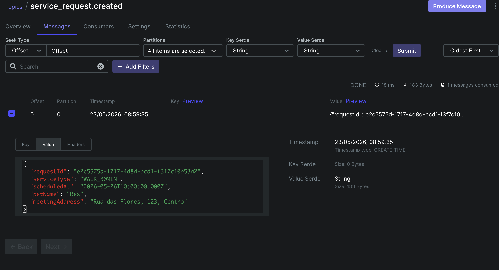
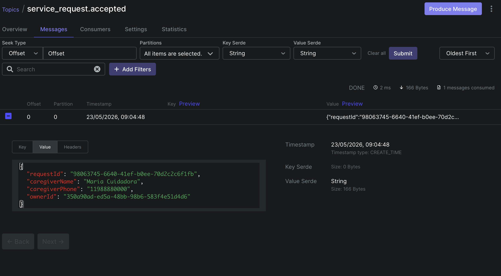
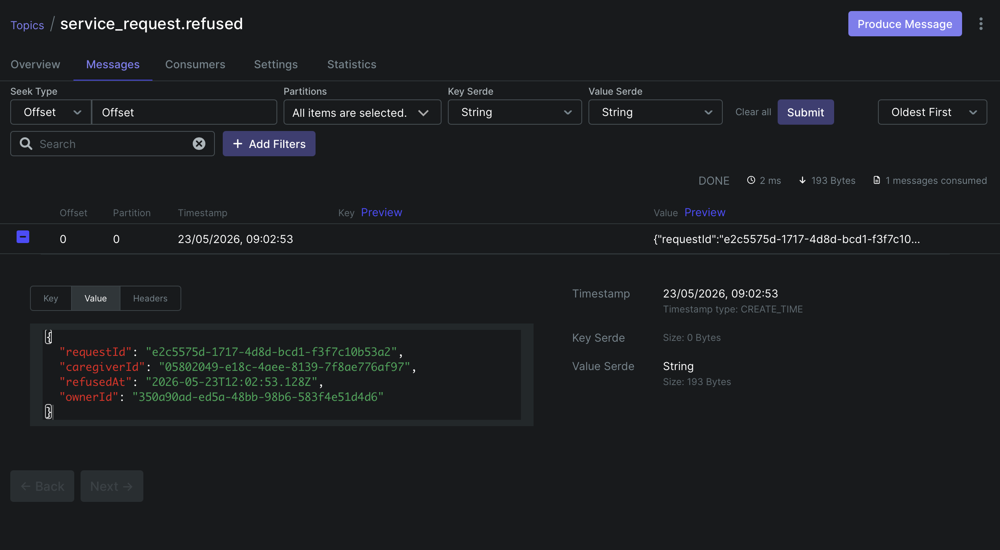
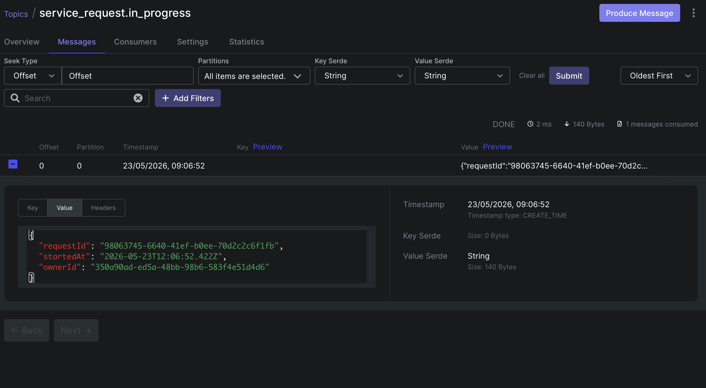
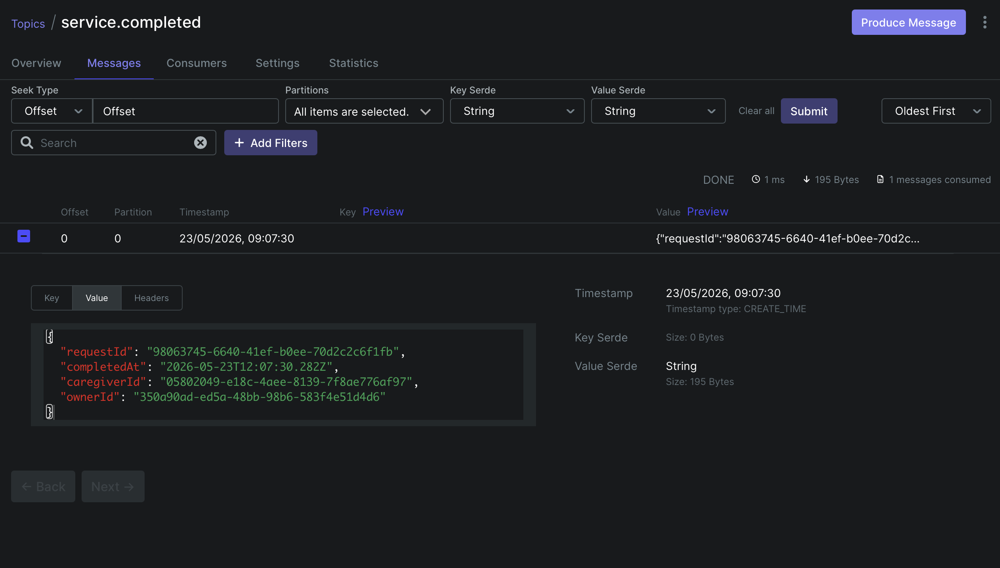
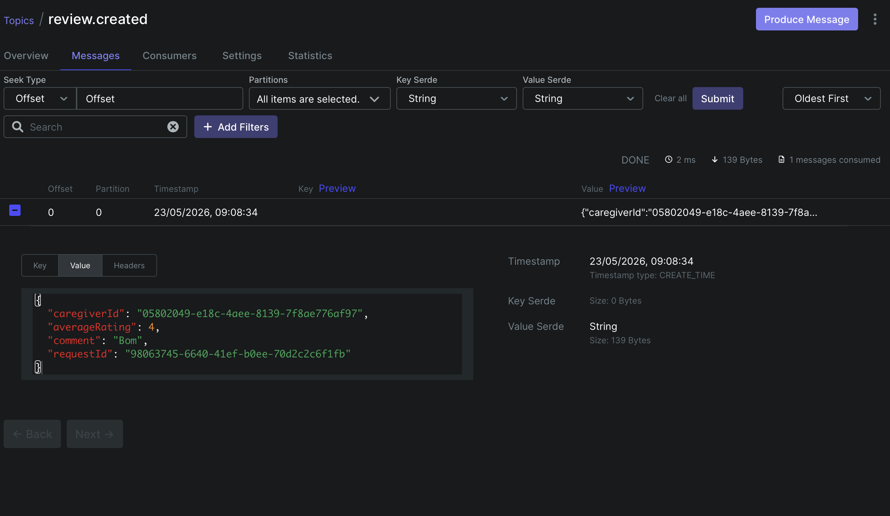

# Documentação de Integração com MOM — Plantão Pet

---

## 1. Visão Geral

O sistema **Plantão Pet** utiliza **Apache Kafka** como middleware orientado a mensagens (MOM). Toda comunicação assíncrona entre os módulos do backend é realizada via tópicos Kafka, sem chamadas REST diretas entre os serviços. O consumer e o producer operam de forma desacoplada: o producer publica eventos em tópicos e o consumer processa cada mensagem de forma independente, notificando os usuários via WebSocket (Socket.IO).

---

## 2. Tecnologia Utilizada

| Item | Valor |
|---|---|
| MOM escolhido | Apache Kafka |
| Biblioteca cliente | `kafkajs` |
| Group ID do consumer | `plantao-pet-group` |
| Serialização | JSON (string) |
| Padrão de mensageria | Publish/Subscribe (tópicos) |
| Notificação em tempo real | Socket.IO (emitido pelo consumer) |
| Deduplicação | Verificação de duplicatas no repositório antes de salvar/emitir |

---

## 3. Arquitetura de Comunicação Assíncrona

```
[Serviço de Negócio]
        │
        │  producer.publish(topic, payload)
        ▼
  ┌─────────────┐
  │  Apache     │   Tópico Kafka
  │  Kafka      │──────────────────────────────────────┐
  │  Broker     │                                      │
  └─────────────┘                                      │
                                                       ▼
                                             [Kafka Consumer]
                                                       │
                                          handler[topic](payload)
                                                       │
                                          saveAndEmit(userId, event)
                                                       │
                                             ┌─────────┴─────────┐
                                             ▼                   ▼
                                    [notifications DB]    [Socket.IO emit]
                                                               │
                                                     ┌─────────┴─────────┐
                                                     ▼                   ▼
                                               [owner client]   [caregiver client]
```

Não há nenhuma chamada REST do consumer para os serviços de negócio — a única comunicação é via Kafka.

---

## 4. Tópicos Configurados

O consumer está inscrito nos seguintes tópicos:

```
service_request.created
service_request.accepted
service_request.refused
service_request.in_progress
service.completed
review.created
```

---

## 5. Tabela de Eventos

### 5.1 `service_request.created`

| Campo | Detalhe |
|---|---|
| **Produtor** | `service-requests.service.js` → `create()` |
| **Consumidor** | `kafka.consumer.js` → handler `service_request.created` |
| **Evento Socket emitido** | `new_request` (para todos os cuidadores ativos) |
| **Destinatário** | Todos os `caregiver` com status ACTIVE |

**Payload JSON publicado:**
```json
{
  "requestId": "2306bc83-9a50-4acc-acbe-84d29adeb3a0",
  "serviceType": "WALK_30MIN",
  "scheduledAt": "2026-05-17T10:00:00.000Z",
  "petName": "Rex",
  "meetingAddress": "Rua das Flores, 123, Centro"
}
```

**Evidência no Kafka UI:**



---

### 5.2 `service_request.accepted`

| Campo | Detalhe |
|---|---|
| **Produtor** | `service-requests.service.js` → `accept()` |
| **Consumidor** | `kafka.consumer.js` → handler `service_request.accepted` |
| **Evento Socket emitido** | `request_accepted` |
| **Destinatário** | `owner` da solicitação |

**Payload JSON publicado:**
```json
{
  "requestId": "2306bc83-9a50-4acc-acbe-84d29adeb3a0",
  "caregiverName": "Maria Cuidadora",
  "caregiverPhone": "11988880000",
  "ownerId": "e5c93a04-575a-4d0b-a6f7-cef76e908691"
}
```

**Evidência no Kafka UI:**



---

### 5.3 `service_request.refused`

| Campo | Detalhe |
|---|---|
| **Produtor** | `service-requests.service.js` → `refuse()` |
| **Consumidor** | `kafka.consumer.js` → handler `service_request.refused` |
| **Evento Socket emitido** | `request_refused` |
| **Destinatário** | `owner` da solicitação |

**Payload JSON publicado:**
```json
{
  "requestId": "2306bc83-9a50-4acc-acbe-84d29adeb3a0",
  "caregiverId": "dcc4f2ca-a9e8-4bfc-9662-1a268d8dc422",
  "refusedAt": "2026-05-16T12:42:39.736Z",
  "ownerId": "e5c93a04-575a-4d0b-a6f7-cef76e908691"
}
```

**Evidência no Kafka UI:**



---

### 5.4 `service_request.in_progress`

| Campo | Detalhe |
|---|---|
| **Produtor** | `service-requests.service.js` → `start()` |
| **Consumidor** | `kafka.consumer.js` → handler `service_request.in_progress` |
| **Evento Socket emitido** | `service_started` |
| **Destinatário** | `owner` da solicitação |

**Payload JSON publicado:**
```json
{
  "requestId": "2306bc83-9a50-4acc-acbe-84d29adeb3a0",
  "startedAt": "2026-05-16T12:43:46.014Z",
  "ownerId": "e5c93a04-575a-4d0b-a6f7-cef76e908691"
}
```

**Evidência no Kafka UI:**



---

### 5.5 `service.completed`

| Campo | Detalhe |
|---|---|
| **Produtor** | `service-requests.service.js` → `complete()` |
| **Consumidor** | `kafka.consumer.js` → handler `service.completed` |
| **Evento Socket emitido** | `service_completed` |
| **Destinatário** | `owner` da solicitação |

**Payload JSON publicado:**
```json
{
  "requestId": "2306bc83-9a50-4acc-acbe-84d29adeb3a0",
  "completedAt": "2026-05-16T12:44:54.552Z",
  "caregiverId": "dcc4f2ca-a9e8-4bfc-9662-1a268d8dc422",
  "ownerId": "e5c93a04-575a-4d0b-a6f7-cef76e908691"
}
```

**Evidência no Kafka UI:**



---

### 5.6 `review.created`

| Campo | Detalhe |
|---|---|
| **Produtor** | `reviews.service.js` → `create()` |
| **Consumidor** | `kafka.consumer.js` → handler `review.created` |
| **Evento Socket emitido** | `new_review` |
| **Destinatário** | `caregiver` avaliado |

**Payload JSON publicado:**
```json
{
  "caregiverId": "dcc4f2ca-a9e8-4bfc-9662-1a268d8dc422",
  "averageRating": 5,
  "comment": "Excelente cuidador, muito atencioso com o Rex!",
  "requestId": "2306bc83-9a50-4acc-acbe-84d29adeb3a0"
}
```

**Evidência no Kafka UI:**



---

## 6. Evidência de Funcionamento

### 6.1 Logs de Console (Fluxo Completo — 16/05/2026)

O trecho abaixo demonstra o ciclo completo de uma solicitação, desde a criação até a avaliação, com producer e consumer operando de forma assíncrona:

```
[KAFKA SEND] Evento publicado no tópico "service_request.created"
[KAFKA RECV] Recebido [service_request.created] - ID: 2306bc83-9a50-4acc-acbe-84d29adeb3a0

[KAFKA SEND] Evento publicado no tópico "service_request.accepted"
[KAFKA RECV] Recebido [service_request.accepted] - ID: 2306bc83-9a50-4acc-acbe-84d29adeb3a0

[KAFKA SEND] Evento publicado no tópico "service_request.refused"
[KAFKA RECV] Recebido [service_request.refused] - ID: 2306bc83-9a50-4acc-acbe-84d29adeb3a0

[KAFKA SEND] Evento publicado no tópico "service_request.in_progress"
[KAFKA RECV] Recebido [service_request.in_progress] - ID: 2306bc83-9a50-4acc-acbe-84d29adeb3a0
payload: { requestId: '2306bc83...', startedAt: '2026-05-16T12:43:46.014Z', ownerId: 'e5c93a04...' }

[KAFKA SEND] Evento publicado no tópico "service.completed"
[KAFKA RECV] Recebido [service.completed]
payload: { requestId: '2306bc83...', completedAt: '2026-05-16T12:44:54.552Z', caregiverId: 'dcc4f2ca...', ownerId: 'e5c93a04...' }

[KAFKA SEND] Evento publicado no tópico "review.created"
[KAFKA RECV] Recebido [review.created]
payload: { caregiverId: 'dcc4f2ca...', averageRating: 5, comment: 'Excelente cuidador, muito atencioso com o Rex!', requestId: '2306bc83...' }
```

## 6. Demonstração de Comunicação Assíncrona

A ausência de chamada REST direta entre os serviços é garantida pela arquitetura:

1. O método `complete()` em `service-requests.service.js` chama apenas `producer.publish('service.completed', payload)` — não há `fetch`, `axios` ou qualquer chamada HTTP para outro serviço.
2. O `kafka.consumer.js` recebe a mensagem via `consumer.run({ eachMessage })`, processa com o handler correspondente e emite via Socket.IO.
3. O mesmo padrão se aplica a todos os outros tópicos: `reviews.service.js` publica `review.created` sem saber nada do consumer; o consumer processa e notifica o cuidador via socket.

Evidência nos logs: a linha `[KAFKA SEND]` e a linha `[KAFKA RECV]` são geradas por módulos completamente separados (`kafka.producer.js` e `kafka.consumer.js`), sem nenhum acoplamento direto entre eles.

---

## 7. Relatório de Integração

### Escolha da Ferramenta

O **Apache Kafka** foi escolhido em vez de RabbitMQ ou Redis Pub/Sub pelos seguintes motivos:

- **Persistência de mensagens:** Kafka armazena mensagens no disco por um período configurável. Isso permite que o consumer releia eventos em caso de falha ou reinicialização, sem perda de dados.
- **Reprocessamento:** Com `fromBeginning: false`, o consumer processa apenas mensagens novas; caso necessário, pode ser configurado para reprocessar o histórico.
- **Escalabilidade:** Kafka suporta múltiplas partições e múltiplos consumers no mesmo grupo, preparando o sistema para crescimento horizontal.
- **Ecossistema maduro:** A biblioteca `kafkajs` tem API clara e boa integração com Node.js.

### Padrão Utilizado

O padrão adotado é **Publish/Subscribe com tópicos nomeados por evento de domínio**. Cada mudança de estado relevante no fluxo de negócio gera um evento com nome semântico (ex.: `service_request.accepted`, `service.completed`). O consumer é único e centralizado, responsável por receber todos os eventos e despachar para os handlers corretos, que persistem a notificação no banco e emitem via Socket.IO para os clientes conectados.

Um mecanismo de **deduplicação** (`notificationsRepo.existsDuplicate`) garante que, mesmo em caso de reentrega de mensagem pelo Kafka, a notificação não seja duplicada para o usuário.

### Desafios Encontrados

- **Disponibilidade dos tópicos na inicialização:** O consumer usa um loop de retry com `sleep(3000)` para aguardar os tópicos serem criados no broker antes de tentar se inscrever. Sem esse mecanismo, o serviço falhava na primeira inicialização do ambiente Docker.
- **Singleton do producer:** O producer é instanciado uma única vez e reutilizado (`connected` flag). Múltiplas chamadas a `connect()` sem esse controle geravam erros de reconexão no `kafkajs`.
- **Deduplicação de mensagens:** Kafka pode entregar a mesma mensagem mais de uma vez em caso de falha antes do commit do offset. A solução foi verificar duplicatas no banco de dados antes de persistir ou emitir qualquer notificação.
- **Broadcast para cuidadores:** O evento `service_request.created` precisa ser enviado a todos os cuidadores ativos. Isso exigiu consulta ao repositório dentro do handler do consumer e iteração sobre a lista, publicando uma notificação individual para cada cuidador.

---

## 8. Resumo dos Momentos de Publicação no Fluxo de Negócio

| # | Ação do Usuário | Tópico Publicado | Quem Recebe |
|---|---|---|---|
| 1 | Owner cria solicitação | `service_request.created` | Todos os cuidadores ativos |
| 2 | Cuidador aceita | `service_request.accepted` | Owner |
| 3 | Cuidador recusa | `service_request.refused` | Owner |
| 4 | Cuidador inicia serviço | `service_request.in_progress` | Owner |
| 5 | Cuidador conclui serviço | `service.completed` | Owner |
| 6 | Owner avalia serviço | `review.created` | Cuidador avaliado |
