# App Mobile — Perfil: Cuidador

> Documentação técnica do **Plantão Pet** sob a perspectiva do **Cuidador**. O app Flutter é único — o mesmo binário serve ambos os perfis. Ao fazer login como Cuidador, o sistema exibe a interface descrita neste documento. O perfil é determinado no momento do cadastro e nunca muda.

---

## Sumário

- [O que é o perfil Cuidador?](#o-que-é-o-perfil-cuidador)
- [Fluxo completo do Cuidador](#fluxo-completo-do-cuidador)
- [Arquitetura do app](#arquitetura-do-app)
- [Padrões Arquiteturais Aplicados](#padrões-arquiteturais-aplicados)
- [Estrutura de arquivos](#estrutura-de-arquivos)
- [Configuração e execução](#configuração-e-execução)
- [Segurança — JWT e armazenamento](#segurança--jwt-e-armazenamento)
- [Inicialização — como o app decide o que mostrar](#inicialização--como-o-app-decide-o-que-mostrar)
- [Navegação — as 4 abas do Cuidador](#navegação--as-4-abas-do-cuidador)
- [Telas detalhadas](#telas-detalhadas)
  - [Login](#login)
  - [Cadastro](#cadastro)
  - [Início (Home) — Solicitações Abertas](#início-home--solicitações-abertas)
  - [Detalhe de Solicitação (Cuidador)](#detalhe-de-solicitação-cuidador)
  - [Meus Atendimentos](#meus-atendimentos)
  - [Alertas / Notificações](#alertas--notificações)
  - [Perfil do Cuidador](#perfil-do-cuidador)
- [Modelos de dados](#modelos-de-dados)
- [Repositórios — acesso à API](#repositórios--acesso-à-api)
- [Providers — gerenciamento de estado](#providers--gerenciamento-de-estado)
- [Serviço de Socket.IO — tempo real](#serviço-de-socketio--tempo-real)
- [Widgets reutilizáveis](#widgets-reutilizáveis)
- [Cores e tema](#cores-e-tema)
- [Dependências](#dependências)

---

## O que é o perfil Cuidador?

O **Cuidador** é o profissional que oferece serviços de cuidado para animais de estimação. No app, o Cuidador:

- Recebe solicitações de serviço abertas por donos de pets **em tempo real** — sem precisar atualizar a tela
- Aceita ou recusa cada solicitação individualmente
- Inicia o serviço na data combinada (uma vez aceito, o serviço pertence a ele)
- Conclui o serviço ao terminar o atendimento
- Visualiza seu histórico de atendimentos com filtros por status
- Recebe notificações de cada transição de estado
- Vê sua média de avaliação baseada nas notas que os donos atribuem após cada serviço

O Cuidador **não pode** criar pets, abrir solicitações, ver outros cuidadores, nem avaliar donos — essas são funções exclusivas do perfil Dono.

---

## Fluxo completo do Cuidador

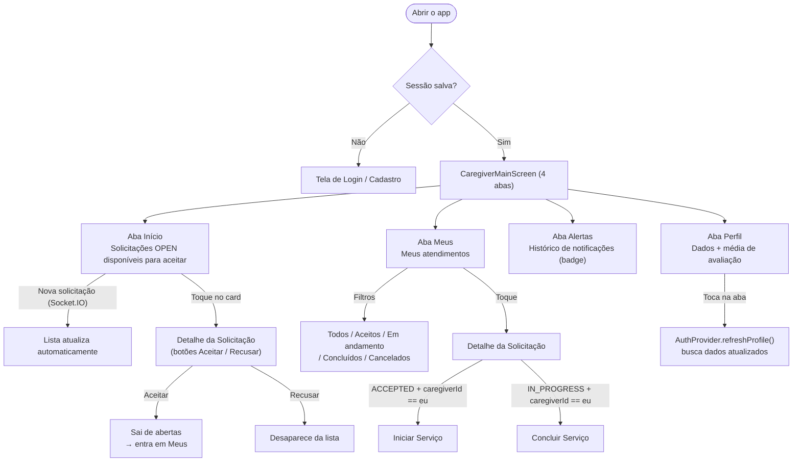

---

## Arquitetura do app

O app segue **Clean Architecture** — cada camada conhece apenas a camada imediatamente abaixo, nunca acima:

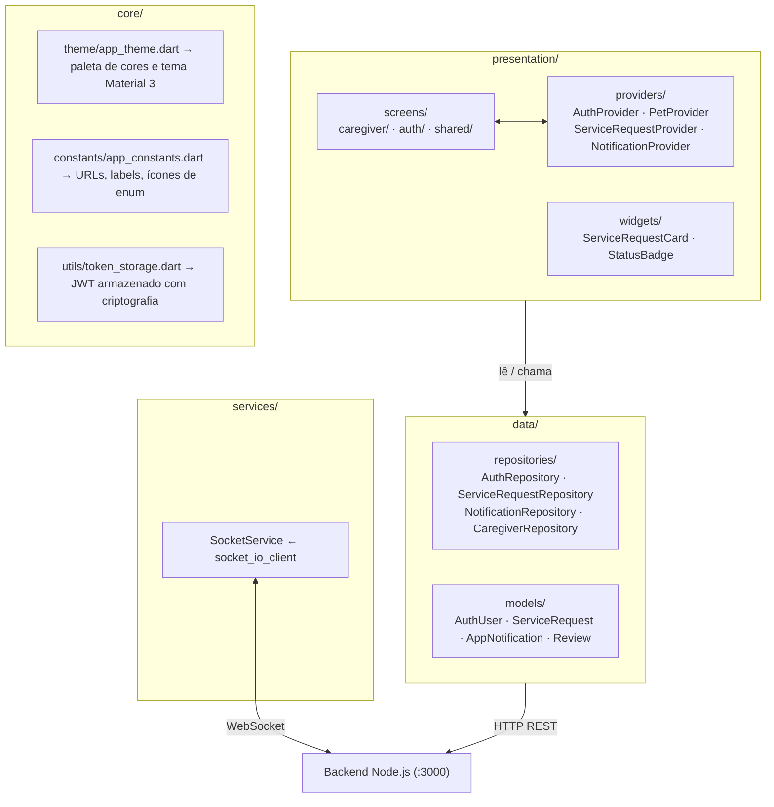

**Gerenciamento de estado:** `provider` (`ChangeNotifier`). O mesmo conjunto de 4 providers é montado para ambos os perfis — mas o `PetProvider` não é usado pelo Cuidador.

**Comunicação REST:** pacote `http`. Cada repositório encapsula as chamadas de um domínio e lança `Exception` em caso de erro HTTP.

---

## Padrões Arquiteturais Aplicados

### Clean Architecture

O app segue **Clean Architecture** (MARTIN, 2019), com regra de dependência unidirecional: camadas externas conhecem as internas, nunca o contrário. Nenhum widget conhece URLs ou parsing JSON; nenhum repositório conhece a existência de telas.

| Camada | Artefatos | Responsabilidade |
|---|---|---|
| `presentation/` | Screens, Providers, Widgets | Renderizar estado e capturar ações do usuário |
| `data/` | Repositories, Models | Acessar a API REST, serializar/deserializar JSON |
| `services/` | SocketService | Manter conexão WebSocket e despachar eventos |
| `core/` | AppTheme, AppConstants, TokenStorage | Configurações e utilitários transversais |

O `SocketService` é criado em `main.dart` e injetado nos providers via construtor — tornando cada componente testável de forma isolada.

### Arquitetura Orientada a Eventos (EDA) e MOM

O sistema adota **Event-Driven Architecture** (HOHPE; WOOLF, 2003), com o **Apache Kafka** como Middleware Orientado a Mensagens (MOM). Toda transição de estado — criação, aceite, início e conclusão de serviço — é publicada como evento em um tópico Kafka. Um consumer independente consome esses eventos, persiste notificações no banco e entrega atualizações em tempo real via Socket.IO.

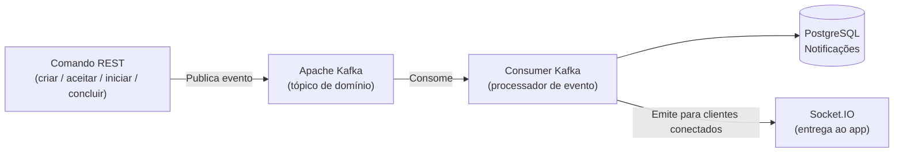

**Benefícios no Plantão Pet:**
- A lógica de negócio não conhece os destinatários das notificações — apenas publica eventos
- Novos consumidores (push notifications, e-mail) podem ser adicionados sem alterar os serviços existentes
- O Kafka persiste eventos mesmo que o consumer esteja temporariamente indisponível

### REST como protocolo de comando

As chamadas HTTP REST são usadas exclusivamente para **comandos** — ações que alteram estado no servidor. A **leitura assíncrona de atualizações** ocorre via Socket.IO, eliminando polling e garantindo que a UI do Cuidador reflita novas solicitações em tempo real, sem nenhuma ação manual.

---

## Estrutura de arquivos

```
mobile/lib/
├── main.dart                                       ← ponto de entrada
│
├── core/
│   ├── constants/app_constants.dart               ← URLs, labels, ícones
│   ├── theme/app_theme.dart                       ← cores e tema
│   └── utils/token_storage.dart                  ← JWT seguro
│
├── data/
│   ├── models/
│   │   ├── auth_model.dart                        ← AuthUser
│   │   ├── service_request_model.dart             ← ServiceRequest + aninhados
│   │   ├── notification_model.dart                ← AppNotification
│   │   └── review_model.dart                      ← Review
│   └── repositories/
│       ├── auth_repository.dart
│       ├── service_request_repository.dart
│       ├── notification_repository.dart
│       └── caregiver_repository.dart              ← inclui CaregiverSummary
│
├── presentation/
│   ├── providers/
│   │   ├── auth_provider.dart
│   │   ├── service_request_provider.dart
│   │   └── notification_provider.dart
│   ├── screens/
│   │   ├── auth/
│   │   │   ├── login_screen.dart                 ← Login (dono e cuidador)
│   │   │   └── register_screen.dart              ← Cadastro (dono e cuidador)
│   │   ├── caregiver/                            ← TELAS EXCLUSIVAS DO CUIDADOR
│   │   │   ├── caregiver_main_screen.dart        ← shell com 4 abas
│   │   │   ├── caregiver_home_screen.dart        ← solicitações abertas
│   │   │   ├── caregiver_request_detail_screen.dart
│   │   │   ├── caregiver_my_requests_screen.dart ← meus atendimentos
│   │   │   ├── caregiver_notifications_screen.dart
│   │   │   └── caregiver_profile_screen.dart
│   │   └── shared/
│   │       └── caregiver_detail_screen.dart      ← perfil público de cuidador
│   └── widgets/
│       ├── service_request_card.dart
│       └── status_badge.dart
│
└── services/
    └── socket_service.dart
```

---

## Configuração e execução

### Pré-requisitos

- Flutter SDK 3.3.0+
- Xcode (para iOS) ou Android Studio (para Android)
- Backend Plantão Pet rodando — ver [docs/backend-api.md](backend-api.md)

### Variáveis de ambiente

As URLs da API são injetadas em **tempo de compilação** com `--dart-define-from-file`. Nunca ficam hardcoded no código.

```bash
cd mobile
cp .env.example .env
```

Edite `.env`:
```env
# iOS Simulator (padrão)
BASE_URL=http://localhost:3000
SOCKET_URL=http://localhost:3000

# Android Emulator (troque se for rodar no Android)
# BASE_URL=http://10.0.2.2:3000
# SOCKET_URL=http://10.0.2.2:3000
```

### Executar o app como Cuidador

Para testar o fluxo completo, rode dois simuladores em terminais separados — um com conta de Dono e outro com conta de Cuidador:

```bash
# Terminal 1 — Cuidador (iPhone 17 Pro)
cd mobile
flutter run -d "iPhone 17 Pro" --dart-define-from-file=.env

# Terminal 2 — Dono do Pet (iPhone 17)
cd mobile
flutter run -d "iPhone 17" --dart-define-from-file=.env
```

Ver detalhes completos de como configurar dois simuladores no [README principal](../README.md#testando-com-dois-simuladores-dono--cuidador).

---

## Segurança — JWT e armazenamento

### TokenStorage (`core/utils/token_storage.dart`)

Toda credencial é armazenada com **`flutter_secure_storage`** — nunca em `SharedPreferences` comum:

| Dado salvo | Chave | Mecanismo no iOS | Mecanismo no Android |
|---|---|---|---|
| JWT | `jwt_token` | Keychain (`first_unlock`) | `EncryptedSharedPreferences` |
| Dados do usuário (JSON) | `user_data` | Keychain | `EncryptedSharedPreferences` |

**`TokenStorage.decodeToken(token)`** — extrai o payload do JWT sem verificar assinatura. Divide por `.`, decodifica o segmento do meio com base64Url e faz `jsonDecode`. Usado logo após o login para obter o `id` do cuidador e fazer a segunda chamada de perfil.

---

## Inicialização — como o app decide o que mostrar

**Arquivo:** `main.dart`

O `main()` inicializa os dados de localização pt_BR antes de rodar o app:

```dart
void main() async {
  WidgetsFlutterBinding.ensureInitialized();
  await initializeDateFormatting('pt_BR');
  runApp(const PlantaoPetApp());
}
```

O `PlantaoPetApp` cria uma instância única de `SocketService` e monta o `MultiProvider`:

```dart
final socket = SocketService();
MultiProvider(providers: [
  ChangeNotifierProvider(create: (_) => AuthProvider(AuthRepository(), socket)),
  ChangeNotifierProvider(create: (_) => PetProvider(PetRepository())),
  ChangeNotifierProvider(create: (_) => ServiceRequestProvider(ServiceRequestRepository(), socket)),
  ChangeNotifierProvider(create: (_) => NotificationProvider(NotificationRepository(), socket)),
], child: MaterialApp(home: const _AppRoot()))
```

O widget `_AppRoot` tenta o auto-login no `initState` e exibe um splash enquanto verifica:

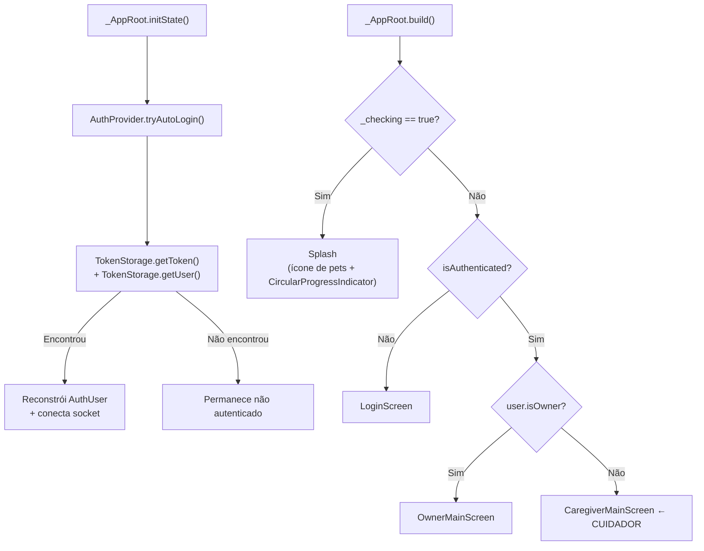

---

## Navegação — as 4 abas do Cuidador

**Arquivo:** `caregiver_main_screen.dart`

`CaregiverMainScreen` usa `IndexedStack` + `BottomNavigationBar`. Com `IndexedStack`, as telas são mantidas em memória ao trocar de aba — o estado não é perdido.

No `initState` (via `addPostFrameCallback`):
1. `srProvider.loadOpen(token)` — carrega solicitações abertas disponíveis para aceitar
2. `srProvider.loadMine(token)` — carrega atendimentos aceitos/em andamento/concluídos
3. `srProvider.listenToSocket(token)` — registra listeners de Socket.IO
4. `notifProvider.load(token)` — carrega o histórico de notificações
5. `notifProvider.listenToSocket(token)` — registra listeners de notificação

No `onTap` do `BottomNavigationBar`:
```dart
onTap: (i) {
  if (i == 3) context.read<AuthProvider>().refreshProfile(); // aba Perfil
  setState(() => _currentIndex = i);
}
```
Ao tocar na aba Perfil (índice 3), `refreshProfile()` é chamado para buscar dados atualizados do backend — incluindo a média de avaliações mais recente.

| Índice | Ícone | Label | Tela |
|---|---|---|---|
| 0 | `Icons.home_outlined` / `Icons.home` | Início | `CaregiverHomeScreen` |
| 1 | `Icons.list_alt_outlined` / `Icons.list_alt` | Meus | `CaregiverMyRequestsScreen` |
| 2 | `Icons.notifications_outlined` / `Icons.notifications` | Alertas | `CaregiverNotificationsScreen` |
| 3 | `Icons.person_outlined` / `Icons.person` | Perfil | `CaregiverProfileScreen` |

O badge da aba Alertas usa o widget `Badge` do Material 3 com o número de não lidas — só fica visível quando `unreadCount > 0`.

**Callbacks entre telas:**
- `CaregiverHomeScreen(onAccepted: ...)` — ao aceitar uma solicitação, navega automaticamente para a aba "Meus" (índice 1)
- `CaregiverNotificationsScreen(onNavigate: ...)` — ao tocar em uma notificação de `service_request.created`, navega para a aba "Início" (0); para `review.created`, navega para "Perfil" (3)

---

## Telas detalhadas

### Login

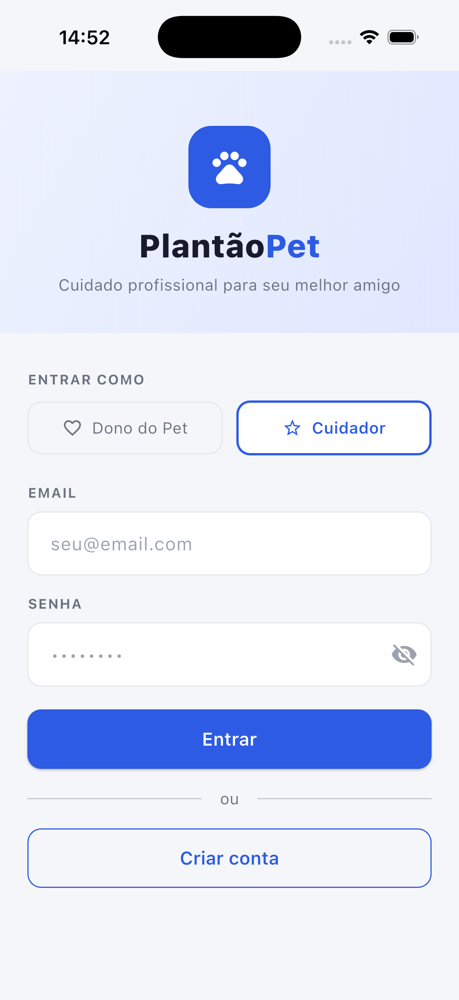

**Arquivo:** `screens/auth/login_screen.dart`

Tela única para ambos os perfis. O usuário escolhe o tipo de conta antes de digitar e-mail e senha.

**Componentes:**
- `_Header`: área com gradiente roxo-claro (`#EEF2FF` → `#E0E7FF`), ícone de pets, logo "Plantão**Pet**" e tagline "Cuidado profissional para seu melhor amigo"
- `RoleToggle`: dois botões lado a lado ("Dono do Pet" com `Icons.favorite_border` e "Cuidador" com `Icons.star_border`). O selecionado recebe borda azul 2px, fundo branco e texto/ícone em azul
- Campo e-mail com validação `contains('@')`
- Campo senha com toggle de visibilidade (`Icons.visibility_off` / `Icons.visibility`)
- Botão "Entrar" — desabilitado durante loading (`auth.loading == true`), exibe `CircularProgressIndicator`
- Separador "ou" + `OutlinedButton` "Criar conta" → abre `RegisterScreen` com o perfil já selecionado

**Fluxo de login do Cuidador:**
1. `_isOwner == false` → chama `AuthProvider.loginCaregiver(email, senha)`
2. Provider chama `AuthRepository.loginCaregiver()` → `POST /auth/caregiver/login`
3. Extrai token da resposta, decodifica com `TokenStorage.decodeToken()` para pegar `id`
4. Faz segunda chamada: `GET /caregivers/{id}` para buscar dados completos do perfil
5. Salva token e usuário no `TokenStorage`
6. Conecta `SocketService` com o token (passado como query param)
7. `_AppRoot` detecta mudança no `AuthProvider` e exibe `CaregiverMainScreen`

---

### Cadastro

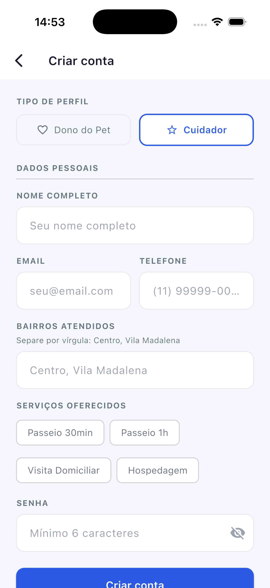

**Arquivo:** `screens/auth/register_screen.dart`

Tela única para ambos os perfis — a seleção do perfil determina quais campos aparecem.

**Campos para o Cuidador:**

| Campo | Validação | Observação |
|---|---|---|
| Tipo de perfil | Obrigatório | `RoleToggle` |
| Nome completo | Mínimo 2 caracteres | — |
| Email | Deve conter `@` | — |
| Telefone | Mínimo 10 dígitos | `replaceAll(RegExp(r'\D'), '')` antes de enviar |
| Bairros atendidos | Pelo menos 1, separados por vírgula | Campo de texto livre: "Centro, Vila Madalena" |
| Serviços oferecidos | Pelo menos 1 selecionado | Multi-select de tipos de serviço (`FilterChip`) |
| Senha | Mínimo 6 caracteres | Toggle de visibilidade |

**Campos específicos do Cuidador** (não existem para o Dono):
- **Bairros atendidos:** campo de texto livre onde o cuidador digita os bairros separados por vírgula (ex: "Centro, Vila Madalena"). O código faz `split(',').map(trim).where(notEmpty)` antes de enviar.
- **Serviços oferecidos:** `FilterChip` para cada tipo de serviço — seleção múltipla com label traduzido (`WALK_30MIN` = "Passeio 30min", etc.)

Ao submeter:
1. Chama `AuthProvider.registerCaregiver({name, email, phone, neighborhoods, services, password})`
2. Provider chama `AuthRepository.registerCaregiver()` → `POST /auth/caregiver/register`
3. Salva token e usuário no `TokenStorage`, conecta socket
4. `Navigator.popUntil(isFirst)` → `_AppRoot` exibe `CaregiverMainScreen`

---

### Início (Home) — Solicitações Abertas

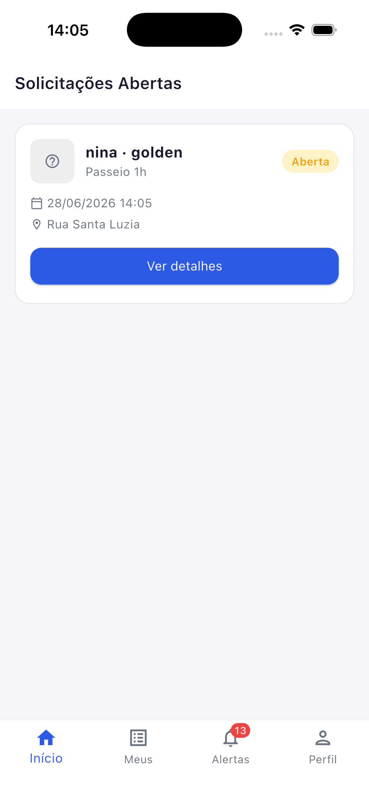

**Arquivo:** `screens/caregiver/caregiver_home_screen.dart`

`CaregiverHomeScreen` é um `StatelessWidget` — toda a lista é lida diretamente de `ServiceRequestProvider.openRequests`. Quando uma nova solicitação chega via Socket.IO, o provider emite `notifyListeners()` e esta tela re-renderiza automaticamente.

**AppBar:**
- Título "Solicitações Abertas"

**Lista:**
- `RefreshIndicator` envolvendo `ListView.builder` para pull to refresh
- Exibe `CircularProgressIndicator` centralizado enquanto `srProvider.loading`
- Um `_OpenRequestCard` para cada item em `srProvider.openRequests`
- Estado vazio: `Icons.pets` + "Nenhuma solicitação aberta"

**`_OpenRequestCard`** — estrutura de cada card:
- **Linha superior:** ícone da espécie (fundo colorido 12% opacidade, 48×48) + "nome · raça" em negrito + badge inline "Aberta" (container personalizado, não `StatusBadge`)
- **Data/hora:** `Icons.calendar_today_outlined` + `dd/MM/yyyy HH:mm` em horário local
- **Endereço:** `Icons.location_on_outlined` + `meetingAddress` (overflow ellipsis)
- **Botão "Ver detalhes"** (`ElevatedButton` azul, largura total) → abre `CaregiverRequestDetailScreen`; ao retornar com `true` (aceite), chama `onAccepted()`

---

### Detalhe de Solicitação (Cuidador)

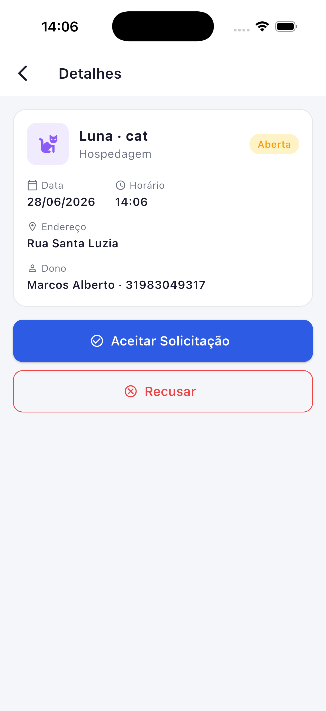

**Arquivo:** `screens/caregiver/caregiver_request_detail_screen.dart`

Tela reativa que assina **dois** campos do provider simultaneamente para garantir consistência durante transições de status:

```dart
final request = srProvider.openRequests.firstWhere(
  (r) => r.id == widget.request.id,
  orElse: () => srProvider.requests.firstWhere(
    (r) => r.id == widget.request.id,
    orElse: () => widget.request,
  ),
);
```

Se a solicitação saiu de `openRequests` (após aceite) e entrou em `requests`, a tela ainda exibe o dado correto.

**Informações exibidas:**
- Ícone da espécie colorido (52×52) + nome do pet + raça
- Tipo de serviço + `StatusBadge`
- Data formatada (`dd/MM/yyyy`) e horário (`HH:mm`) em horário local
- Endereço de atendimento
- "Dono: {nome} · {telefone}"

**Botões de ação — condicionais:**

| Condição | Botão exibido | Comportamento |
|---|---|---|
| `status == 'OPEN'` | "Aceitar Solicitação" (`ElevatedButton.icon`, `Icons.check_circle_outline`) + "Recusar" (`OutlinedButton.icon`, `Icons.cancel_outlined` vermelho) | Aceitar → SnackBar + `pop(context, true)`. Recusar → `pop()` |
| `status == 'ACCEPTED'` e `caregiverId == user.id` | "Iniciar Serviço" (`ElevatedButton.icon`, `Icons.play_circle_outline`, fundo verde) | SnackBar verde "Serviço iniciado!" — tela continua aberta |
| `status == 'IN_PROGRESS'` e `caregiverId == user.id` | "Concluir Serviço" (`ElevatedButton.icon`, `Icons.flag_outlined`, fundo `statusCompleted` cinza) | AlertDialog "Não"/"Confirmar" → SnackBar → `pop()` |
| `status == 'COMPLETED'` | Nenhum botão de ação | — |
| `status == 'CANCELLED'` / `'REFUSED'` | Nenhum botão | — |

**Erro de limite ao aceitar:**
Quando o aceite falha com mensagem contendo "atendimentos em andamento", o SnackBar usa cor `warning` (âmbar) e duração de 4 segundos — diferente do erro genérico que usa cor `error` (vermelho).

**Fluxo ao aceitar:**
1. `srProvider.accept(request.id, token)`
2. Provider: remove de `_openRequests` + `_updateInMine(updated)` em `_requests`
3. SnackBar verde "Solicitação aceita!" → `Navigator.pop(context, true)` → `CaregiverHomeScreen.onAccepted()` navega para aba "Meus"

**Fluxo ao iniciar:**
1. `srProvider.start(request.id, token)`
2. Provider: `_updateInMine(updated)` — `status` muda para `IN_PROGRESS`
3. SnackBar verde "Serviço iniciado!" — tela continua aberta, status atualiza reativamente

**Fluxo ao concluir:**
1. `AlertDialog` "Confirmar conclusão?" (Cancelar / Confirmar)
2. Confirmar → `srProvider.complete(request.id, token)`
3. SnackBar "Serviço concluído com sucesso!" → `Navigator.pop()`

---

### Meus Atendimentos

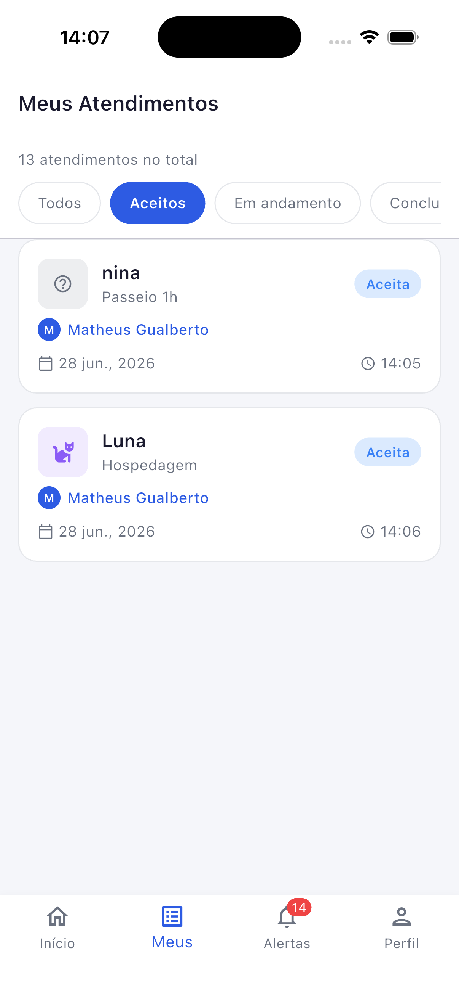

**Arquivo:** `screens/caregiver/caregiver_my_requests_screen.dart`

Lista de todos os atendimentos que o cuidador aceitou (em qualquer status exceto OPEN).

**Cabeçalho:**
- Contador: `"${srProvider.requests.length} atendimento(s) no total"`

**Filtros (chips horizontais scrolláveis — 5 opções):**

| Chip | Status filtrado |
|---|---|
| Todos | nenhum (exibe todos) |
| Aceitos | `ACCEPTED` |
| Em andamento | `IN_PROGRESS` |
| Concluídos | `COMPLETED` |
| Cancelados | `CANCELLED` |

**Lista:**
- Um `ServiceRequestCard` para cada atendimento filtrado
- Toque → abre `CaregiverRequestDetailScreen`
- Estado vazio: ícone cinza + mensagem contextual (muda se filtro ativo)
- Pull to refresh: chama `srProvider.loadMine(token)`

---

### Alertas / Notificações

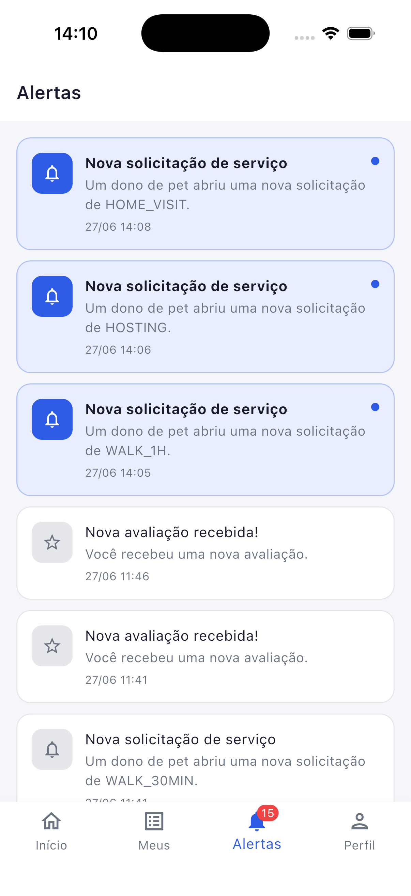

**Arquivo:** `screens/caregiver/caregiver_notifications_screen.dart`

Exibe o histórico de notificações recebidas pelo cuidador. Esta é uma tela separada, exclusiva do Cuidador — **não é compartilhada** com o perfil Dono (que tem `OwnerNotificationsScreen` própria).

**Eventos que o Cuidador recebe:**

| `eventType` | Título exibido | Corpo exibido |
|---|---|---|
| `service_request.created` | "Nova solicitação de serviço" | "Uma nova solicitação está disponível." |
| `service_request.refused` | "Solicitação recusada" | "Você recusou uma solicitação." |
| `service_request.cancelled` | "Solicitação cancelada" | "O dono cancelou a solicitação." |
| `review.created` | "Nova avaliação recebida" | "Você recebeu uma nova avaliação." |

Notificações não lidas (`readAt == null`) têm fundo diferenciado. Toque em uma notificação chama `NotificationProvider.markRead()` que:
1. Envia `PATCH /notifications/:id/read` para a API
2. Emite evento `mark_read` via Socket.IO
3. Atualiza localmente o `readAt` para `DateTime.now()`

---

### Perfil do Cuidador

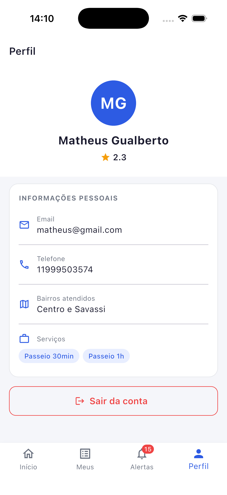

**Arquivo:** `screens/caregiver/caregiver_profile_screen.dart`

Tela que exibe dados do cuidador e a média de avaliações recebidas.

**Layout:**

**Cabeçalho (fundo branco, `padding: 24`):**
- Avatar circular azul (80×80) com iniciais
- Nome do cuidador
- Linha de avaliação: `Icons.star` âmbar + `averageRating?.toStringAsFixed(1) ?? '0.0'`

**Seção INFORMAÇÕES PESSOAIS** (card com borda):
Linha a linha com `_InfoRow` (ícone + label + valor):
- `Icons.email_outlined` — Email
- `Icons.phone_outlined` — Telefone
- `Icons.map_outlined` — Bairros atendidos (join por vírgula) — exibido apenas se `neighborhoods != null && isNotEmpty`
- `Icons.work_outline` — Serviços — chips azuis com labels traduzidos, exibido apenas se `services != null && isNotEmpty`

**Botão Logout:**
`OutlinedButton.icon` vermelho "Sair da conta" → `AlertDialog` "Tem certeza que deseja sair?" → confirmar chama:
```dart
AuthProvider.logout()
  └── SocketService.disconnect()   ← fecha WebSocket
  └── TokenStorage.clear()         ← apaga jwt_token e user_data
  └── _user = null → _AppRoot exibe LoginScreen
```

**Como a média de avaliação é atualizada:**
Ao tocar no índice 3 (Perfil) do `BottomNavigationBar`, `CaregiverMainScreen` chama `auth.refreshProfile()`. Esse método faz `GET /caregivers/:id` e reconstrói o `AuthUser` com `averageRating` atualizado. A `CaregiverProfileScreen` relê `context.watch<AuthProvider>().user!.averageRating`.

---

## Modelos de dados

### `AuthUser` (`data/models/auth_model.dart`)

Representa o usuário autenticado. O mesmo modelo serve Dono e Cuidador.

| Campo | Tipo | Relevância para o Cuidador |
|---|---|---|
| `id` | `String` | UUID único |
| `role` | `String` | `'caregiver'` |
| `name` | `String` | Nome completo |
| `email` | `String` | E-mail de acesso |
| `phone` | `String` | Telefone (somente dígitos) |
| `token` | `String` | JWT Bearer para todas as chamadas de API |
| `neighborhoods` | `List<String>?` | Bairros onde atende |
| `services` | `List<String>?` | Códigos de serviços oferecidos |
| `averageRating` | `double?` | Média das notas recebidas (null = sem avaliações) |
| `status` | `String?` | `'ACTIVE'` ou `'INACTIVE'` |
| `address` | `String?` | Null para o Cuidador |

**Getters:**
- `isOwner` → `role == 'owner'`
- `isCaregiver` → `role == 'caregiver'`
- `initials` → primeiras letras do primeiro e segundo nome em maiúsculas (ex: "Carlos Melo" → "CM")

---

### `ServiceRequest` e classes aninhadas (`data/models/service_request_model.dart`)

**`ServiceRequestPet`** — snapshot do pet no momento da criação da solicitação:

| Campo | Tipo |
|---|---|
| `id` | `String` |
| `name` | `String` |
| `species` | `String` (`'DOG'`, `'CAT'` ou `'OTHER'`) |
| `breed` | `String` |

**`ServiceRequestUser`** — snapshot de um usuário (dono ou cuidador):

| Campo | Tipo |
|---|---|
| `id` | `String` |
| `name` | `String` |
| `phone` | `String` |

Getter `initials` disponível.

**`ServiceRequestReview`** — avaliação associada:

| Campo | Tipo |
|---|---|
| `id` | `String` |
| `rating` | `int` (1–5) |
| `comment` | `String` |

**`ServiceRequest`** — modelo principal:

| Campo | Tipo | Descrição |
|---|---|---|
| `id` | `String` | UUID |
| `petId` | `String` | UUID do pet |
| `ownerId` | `String` | UUID do dono |
| `caregiverId` | `String?` | UUID do cuidador aceito (null enquanto OPEN) |
| `serviceType` | `String` | `WALK_30MIN`, `WALK_1H`, `HOME_VISIT` ou `HOSTING` |
| `scheduledAt` | `DateTime` | UTC — chamar `.toLocal()` para exibir |
| `meetingAddress` | `String` | Endereço de encontro |
| `status` | `String` | `OPEN` → `ACCEPTED` → `IN_PROGRESS` → `COMPLETED` |
| `expiresAt` | `DateTime` | 24h após criação |
| `createdAt` | `DateTime` | — |
| `pet` | `ServiceRequestPet` | Snapshot do pet |
| `owner` | `ServiceRequestUser` | Snapshot do dono |
| `caregiver` | `ServiceRequestUser?` | Null enquanto OPEN |
| `review` | `ServiceRequestReview?` | Null até o dono avaliar |

**Verificação de posse do atendimento:**
```dart
request.caregiverId == auth.user!.id
```
Usada em `CaregiverRequestDetailScreen` para exibir botões de controle (Iniciar, Concluir) apenas para o cuidador responsável.

---

### `AppNotification` (`data/models/notification_model.dart`)

| Campo | Tipo | Descrição |
|---|---|---|
| `id` | `String` | UUID |
| `userId` | `String` | ID do destinatário |
| `userRole` | `String` | `'caregiver'` |
| `eventType` | `String` | Tipo do evento Kafka |
| `payload` | `Map<String, dynamic>` | Dados do evento |
| `requestId` | `String?` | ID da solicitação relacionada |
| `readAt` | `DateTime?` | `null` = não lida |
| `createdAt` | `DateTime` | — |

**Getters:**
- `isRead` → `readAt != null`
- `title` → texto mapeado de `eventType`
- `body` → texto com dados do `payload`

---

### `CaregiverSummary` (`data/repositories/caregiver_repository.dart`)

Modelo para listagem/perfil público. Definido no mesmo arquivo do repositório, não em `models/`:

| Campo | Tipo |
|---|---|
| `id` | `String` |
| `name` | `String` |
| `email` | `String` |
| `phone` | `String` |
| `neighborhoods` | `List<String>` |
| `services` | `List<String>` |
| `averageRating` | `double?` |
| `totalReviews` | `int?` |
| `status` | `String` (`'ACTIVE'` ou `'INACTIVE'`) |

Getter `initials` disponível.

---

### `Review` (`data/models/review_model.dart`)

Usado em `caregiver_detail_screen.dart`:

| Campo | Tipo |
|---|---|
| `id` | `String` |
| `serviceRequestId` | `String` |
| `ownerId` | `String` |
| `caregiverId` | `String` |
| `rating` | `int` (1–5) |
| `comment` | `String` |
| `createdAt` | `DateTime` |

---

## Repositórios — acesso à API

### `AuthRepository` (endpoints do Cuidador)

| Método | HTTP | Endpoint | Descrição |
|---|---|---|---|
| `loginCaregiver(email, password)` | POST → GET | `/auth/caregiver/login` → `/caregivers/{id}` | Login em 2 etapas |
| `registerCaregiver({name, email, phone, neighborhoods, services, password})` | POST | `/auth/caregiver/register` | Cadastro; resposta inclui token |
| `fetchCaregiverProfile(id, token)` | GET | `/caregivers/{id}` | Busca perfil atualizado (chamado por `refreshProfile()`) |
| `updateCaregiverStatus(status, token)` | PATCH | `/caregivers/status` | `{'status': 'ACTIVE' | 'INACTIVE'}` |

**Fluxo de login em 2 etapas:**
```
POST /auth/caregiver/login {email, password}
  → { token: "eyJ..." }
      → TokenStorage.decodeToken(token)['id'] = caregiverId
          → GET /caregivers/{caregiverId}
              → { id, name, email, phone, neighborhoods, services, averageRating, status }
                  → AuthUser(token: token, ...campos)
```

---

### `ServiceRequestRepository`

| Método | HTTP | Endpoint | Descrição |
|---|---|---|---|
| `getOpen(token)` | GET | `/service-requests` | Solicitações OPEN para aceitar |
| `getMine(token)` | GET | `/service-requests/my` | Atendimentos do cuidador |
| `getById(id, token)` | GET | `/service-requests/{id}` | Detalhes |
| `accept(id, token)` | PATCH | `/service-requests/{id}/accept` | Aceita |
| `refuse(id, token)` | PATCH | `/service-requests/{id}/refuse` | Recusa |
| `start(id, token)` | PATCH | `/service-requests/{id}/start` | Inicia |
| `complete(id, token)` | PATCH | `/service-requests/{id}/complete` | Conclui |
| `cancel(id, token)` | PATCH | `/service-requests/{id}/cancel` | Cancelamento (pelo Dono) |

---

### `NotificationRepository`

| Método | HTTP | Endpoint | Descrição |
|---|---|---|---|
| `getAll(token)` | GET | `/notifications` | Histórico completo |
| `markRead(id, token)` | PATCH | `/notifications/{id}/read` | Sem corpo |

---

### `CaregiverRepository`

| Método | HTTP | Endpoint | Retorno |
|---|---|---|---|
| `getAll(token)` | GET | `/caregivers` | `List<CaregiverSummary>` |
| `getById(id, token)` | GET | `/caregivers/{id}` | `CaregiverSummary` |
| `getReviews(id, token)` | GET | `/caregivers/{id}/reviews` | `List<Review>` |

---

## Providers — gerenciamento de estado

### `AuthProvider`

| Campo/Getter | Tipo | Descrição |
|---|---|---|
| `user` | `AuthUser?` | Cuidador autenticado |
| `loading` | `bool` | Operação em andamento |
| `error` | `String?` | Último erro (sem prefixo "Exception: ") |
| `isAuthenticated` | `bool` | `user != null` |

**Métodos relevantes para o Cuidador:**

| Método | Ação |
|---|---|
| `tryAutoLogin()` | Lê storage, reconstrói `AuthUser`, conecta socket |
| `loginCaregiver(email, password)` | Login em 2 etapas → salva → conecta socket → retorna `bool` |
| `registerCaregiver({...})` | Cadastro → salva → conecta socket |
| `refreshProfile()` | `GET /caregivers/:id` → reconstrói `AuthUser` → salva no storage |
| `updateCaregiverStatus(status)` | API PATCH + reconstrói `AuthUser` localmente com novo `status` |
| `logout()` | Desconecta socket → limpa storage → `_user = null` |

**Detalhe de `updateCaregiverStatus()`:**

A atualização do estado local é **imediata** — a UI responde antes de o servidor confirmar:
```dart
_user = AuthUser(
  id: _user!.id, role: _user!.role, name: _user!.name,
  // ... todos os outros campos igual
  status: status,  // apenas este muda
);
notifyListeners();
```

---

### `ServiceRequestProvider`

| Campo/Getter | Tipo | Descrição |
|---|---|---|
| `requests` | `List<ServiceRequest>` | Atendimentos do cuidador |
| `openRequests` | `List<ServiceRequest>` | Solicitações OPEN disponíveis |
| `loading` | `bool` | — |
| `error` | `String?` | — |

**Listeners de Socket.IO** (registrados via `listenToSocket(token)`):

| Evento | Ação |
|---|---|
| `new_request` | `loadOpen(token)` — nova solicitação disponível na home |
| `request_cancelled` | Remove o item de `_openRequests` diretamente pelo `requestId` — sem nova requisição HTTP |
| `request_accepted` | `loadMine(token)` |
| `request_refused` | `loadMine(token)` |
| `service_started` | `loadMine(token)` |
| `service_completed` | `loadMine(token)` |

O mesmo provider é usado por ambos os perfis. Para o Cuidador, `new_request` e `request_cancelled` são os eventos mais críticos da Home — o primeiro adiciona solicitações e o segundo remove sem necessidade de round-trip HTTP.

**Métodos e efeitos:**

| Método | `openRequests` | `requests` |
|---|---|---|
| `loadOpen(token)` | Substitui inteiro | — |
| `loadMine(token)` | — | Substitui inteiro |
| `accept(id, token)` | Remove o item | `_updateInMine(updated)` |
| `refuse(id, token)` | Remove o item | — |
| `cancel(id, token)` | — | `_updateInMine(updated)` |
| `start(id, token)` | — | `_updateInMine(updated)` |
| `complete(id, token)` | — | `_updateInMine(updated)` |

`_updateInMine(updated)`: localiza pelo `id` em `_requests` e substitui in-place. Se não encontrado, insere no topo.

---

### `NotificationProvider`

| Campo/Getter | Tipo | Descrição |
|---|---|---|
| `notifications` | `List<AppNotification>` | Todas as notificações |
| `loading` | `bool` | — |
| `unreadCount` | `int` | `_notifications.where((n) => !n.isRead).length` |

**Listeners:** todos os 7 eventos → `load(token)`:
```dart
final events = [
  'new_request', 'request_cancelled', 'request_accepted', 'request_refused',
  'service_started', 'service_completed', 'new_review',
];
for (final e in events) {
  _socket.on(e, (_) => load(token));
}
```

| Método | Ação |
|---|---|
| `load(token)` | `GET /notifications` |
| `markRead(id, token)` | `PATCH /notifications/:id/read` + `socket.markRead(id)` + `readAt = DateTime.now()` localmente |

---

## Serviço de Socket.IO — tempo real

**Arquivo:** `services/socket_service.dart`

Instância única criada em `main.dart` e compartilhada entre todos os providers.

**Conexão:**
```dart
_socket = io.io(
  AppConstants.socketUrl,
  io.OptionBuilder()
    .setTransports(['websocket'])
    .setQuery({'token': token})  // ← query param, NÃO header HTTP
    .disableAutoConnect()
    .build(),
);
_socket!.connect();
```

O backend valida o JWT do query param via middleware, associa o socket ao `userId` e ao `userRole`, e garante que cada usuário receba somente suas notificações.

**API pública:**

| Método | Descrição |
|---|---|
| `connect(token)` | Desconecta anterior + abre nova conexão |
| `on(event, callback)` | Registra listener (vários callbacks por evento) |
| `off(event, callback)` | Remove listener específico |
| `markRead(notificationId)` | Emite `mark_read` ao servidor |
| `disconnect()` | `dispose()` + limpa `_listeners` |
| `isConnected` | `_socket?.connected ?? false` |

**Fluxo completo de tempo real — Cuidador recebe nova solicitação:**

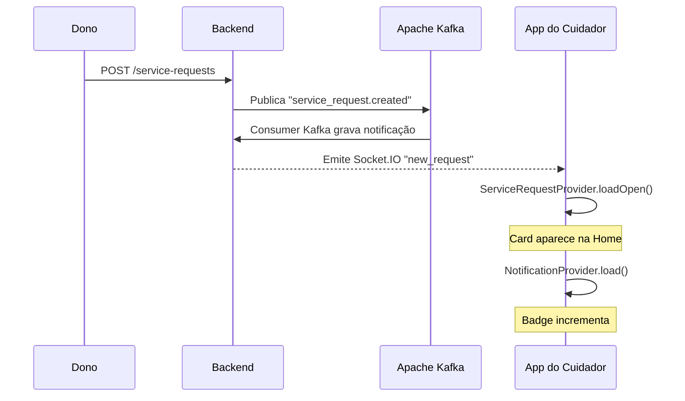

**Fluxo — Cuidador aceita, Dono é notificado:**

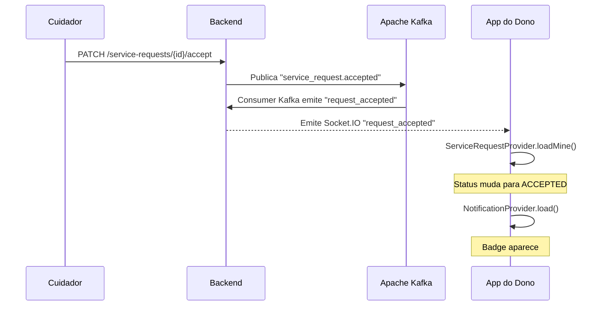

---

## Widgets reutilizáveis

### `StatusBadge` (`widgets/status_badge.dart`)

Chip colorido com texto e fundo por status. Para `IN_PROGRESS`, exibe um ponto verde (7×7 px, `BoxDecoration` circular) à esquerda do texto.

| Status | Texto | Cor do texto | Cor do fundo |
|---|---|---|---|
| `OPEN` | Aberta | `#F59E0B` (âmbar) | `#FEF3C7` |
| `ACCEPTED` | Aceita | `#3B82F6` (azul) | `#DBEAFE` |
| `IN_PROGRESS` | Em andamento | `#10B981` (verde) | `#D1FAE5` |
| `COMPLETED` | Concluída | `#6B7280` (cinza) | `#F3F4F6` |
| `CANCELLED` | Cancelada | `#EF4444` (vermelho) | `#FEE2E2` |
| `REFUSED` | Recusada | `#F97316` (laranja) | `#FFF7ED` |

---

### `ServiceRequestCard` (`widgets/service_request_card.dart`)

Card de listagem. Usado na `CaregiverMyRequestsScreen`.

- Ícone da espécie (44×44, fundo colorido com opacidade 12%)
- Nome do pet + tipo de serviço traduzido
- `StatusBadge` no canto superior direito
- Quando `caregiver != null`: mini-avatar (20×20) com inicial + nome do cuidador em azul
- Data em pt_BR (`dd MMM, yyyy`) e horário (`HH:mm`) em horário local
- `highlighted == true` (status `IN_PROGRESS`): borda verde de 2px em vez da borda cinza

---

## Cores e tema

**Arquivo:** `core/theme/app_theme.dart` — Material 3 com `useMaterial3: true`, fonte Roboto.

### Paleta completa

| Constante | Hex | Uso |
|---|---|---|
| `primary` | `#2D5BE3` | Botões, avatares, bordas ativas, links |
| `primaryLight` | `#E8EEFF` | Fundo de itens selecionados |
| `background` | `#F5F6FA` | Fundo das telas |
| `surface` | `white` | Cards, AppBar, campos |
| `textPrimary` | `#1A1A2E` | Texto principal |
| `textSecondary` | `#6B7280` | Labels, subtítulos |
| `textHint` | `#9CA3AF` | Placeholders |
| `divider` | `#E5E7EB` | Bordas, divisores |
| `error` | `#EF4444` | Erros, SnackBar de falha, botão Recusar |
| `errorLight` | `#FEE2E2` | Fundo de banner de erro |
| `success` | `#10B981` | Badge IN_PROGRESS, botão Iniciar |
| `successLight` | `#D1FAE5` | Fundo de banner verde (`successBg` é alias) |
| `successBorder` | `#6EE7B7` | Borda de banner de sucesso |
| `warning` | `#F59E0B` | Badge OPEN, estrelas, SnackBar de limite |
| `warningText` | `#D97706` | Texto de destaque nos banners de aviso |
| `warningLight` | `#FFFBEB` | Fundo do banner de aviso (`warningBg` é alias) |
| `warningBorder` | `#FCD34D` | Borda do banner de aviso |
| `ratingColor` | `#F59E0B` | Estrelas de avaliação |
| `speciesCat` | `#8B5CF6` | Cor temática do gato (roxo) |

### Ícones de espécie — detalhe importante

```dart
// speciesIconWidget — retorna Widget diferente por espécie
'DOG'   → Icon(Icons.pets, ...)
'CAT'   → Center(child: FaIcon(FontAwesomeIcons.cat, ...))  // Center necessário
'OTHER' → Icon(Icons.help_outline, ...)
```

O `Center` ao redor do `FaIcon` é necessário porque o `FaIcon` (pacote `font_awesome_flutter`) não se centraliza automaticamente dentro de containers como o `Icon` padrão do Material faz.

---

## Dependências

**Arquivo:** `mobile/pubspec.yaml`

| Pacote | Versão | Finalidade |
|---|---|---|
| `provider` | `^6.1.2` | Estado com `ChangeNotifier` |
| `http` | `^1.2.1` | Chamadas HTTP REST |
| `flutter_secure_storage` | `^9.2.4` | JWT seguro (Keychain/EncryptedSharedPreferences) |
| `socket_io_client` | `^2.0.3+1` | WebSocket — token via query param |
| `intl` | `^0.19.0` | Datas em pt_BR |
| `font_awesome_flutter` | `^11.0.0` | Ícone do gato (`FontAwesomeIcons.cat`) |
| `cupertino_icons` | `^1.0.6` | Ícones iOS |
| `flutter_lints` | `^4.0.0` | Lint estático (dev) |

---

<div align="center">
  
</div>
<p align="center">Fonte do banner: <a href="https://github.com/joaopauloaramuni">João Paulo Carneiro Aramuni</a></p>
