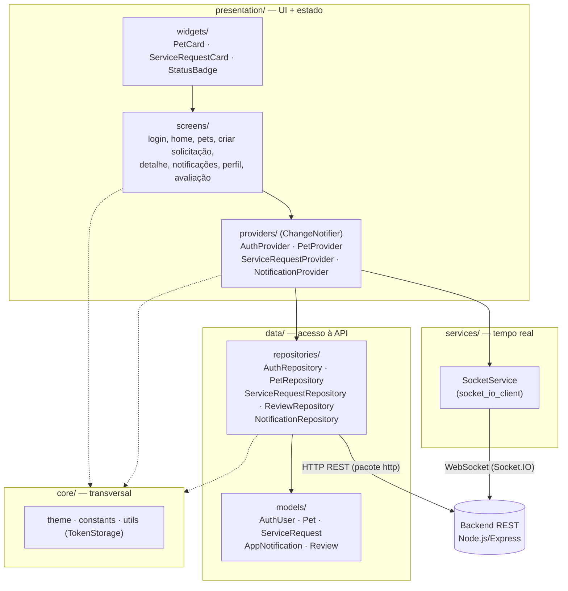
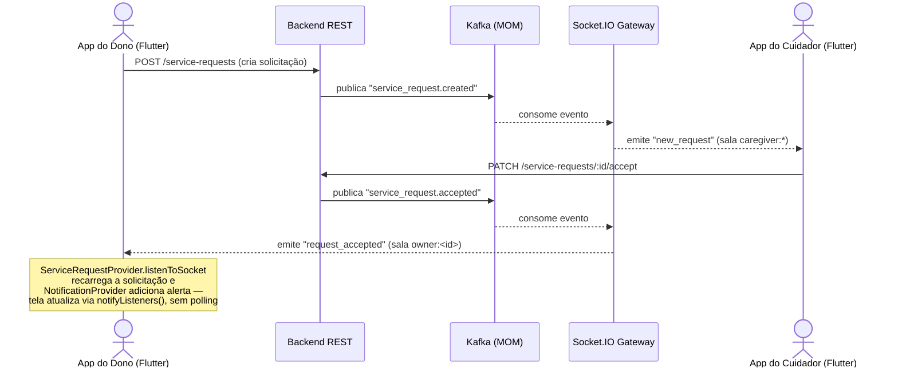

# App do Dono do Pet — Documentação Técnica

> Módulo Flutter do **Plantão Pet** voltado ao dono do animal. Permite cadastro, login, gerenciamento de pets, abertura de solicitações de serviço, acompanhamento em tempo real e avaliação de cuidadores.

---

## Sumário

- [Visão geral](#visão-geral)
- [Arquitetura](#arquitetura)
- [Estrutura de pastas](#estrutura-de-pastas)
- [Configuração e execução](#configuração-e-execução)
- [Segurança](#segurança)
- [Navegação e telas](#navegação-e-telas)
- [Camada de dados](#camada-de-dados)
- [Providers (estado)](#providers-estado)
- [Tempo real via Socket.IO](#tempo-real-via-socketio)
- [Tema e design system](#tema-e-design-system)
- [Dependências](#dependências)

---

## Visão geral

O app do dono é uma das duas interfaces Flutter do sistema. Ele se comunica com o backend Node.js via HTTP/REST e recebe eventos em tempo real via Socket.IO (WebSocket). O app persiste o token JWT no Keychain/Keystore do dispositivo e reconstrói a sessão automaticamente ao abrir.

**Fluxo principal do dono:**

```
Cadastro → Login → Home (solicitações)
                       ↳ Criar solicitação → Aguardar aceite → Acompanhar → Avaliar
             → Pets → Cadastrar / Editar / Deletar pet
             → Alertas → Histórico de notificações
             → Perfil → Dados da conta / Logout
```

---

## Arquitetura

O app segue **Clean Architecture**, com dependências sempre apontando para dentro: as telas conhecem os providers, os providers conhecem os repositórios/serviços, e os repositórios conhecem os modelos — nunca o caminho inverso.



> Estrutura de pastas correspondente em [Estrutura de pastas](#estrutura-de-pastas).

**Gerenciamento de estado:** `provider` com `ChangeNotifier`. Cada domínio tem seu próprio provider (`AuthProvider`, `PetProvider`, `ServiceRequestProvider`, `NotificationProvider`).

**Comunicação com API:** pacote `http`. Cada repositório encapsula um domínio da API e lança `Exception` em caso de erro, que o provider captura e expõe via `error`.

---

## Estrutura de pastas

```
mobile/
├── lib/
│   ├── core/
│   │   ├── constants/
│   │   │   └── app_constants.dart        ← baseUrl, socketUrl, labels de enum
│   │   ├── theme/
│   │   │   └── app_theme.dart            ← AppColors + AppTheme (Material 3)
│   │   └── utils/
│   │       └── token_storage.dart        ← JWT e dados do usuário no Secure Storage
│   ├── data/
│   │   ├── models/
│   │   │   ├── auth_model.dart           ← AuthUser
│   │   │   ├── pet_model.dart            ← Pet
│   │   │   ├── service_request_model.dart ← ServiceRequest + embeds
│   │   │   ├── notification_model.dart   ← AppNotification
│   │   │   └── review_model.dart
│   │   └── repositories/
│   │       ├── auth_repository.dart      ← login / register owner & caregiver
│   │       ├── pet_repository.dart       ← CRUD de pets
│   │       ├── service_request_repository.dart
│   │       ├── review_repository.dart
│   │       └── notification_repository.dart
│   ├── presentation/
│   │   ├── providers/
│   │   │   ├── auth_provider.dart
│   │   │   ├── pet_provider.dart
│   │   │   ├── service_request_provider.dart
│   │   │   └── notification_provider.dart
│   │   ├── screens/
│   │   │   ├── auth/
│   │   │   │   ├── login_screen.dart
│   │   │   │   └── register_screen.dart
│   │   │   └── owner/
│   │   │       ├── owner_main_screen.dart          ← shell com BottomNavigationBar
│   │   │       ├── owner_home_screen.dart          ← lista de solicitações + filtros
│   │   │       ├── pets_screen.dart                ← lista de pets
│   │   │       ├── create_pet_screen.dart          ← criar e editar pet
│   │   │       ├── owner_notifications_screen.dart ← alertas em tempo real
│   │   │       ├── owner_profile_screen.dart       ← dados da conta + logout
│   │   │       ├── create_service_request_screen.dart
│   │   │       ├── service_request_detail_screen.dart ← detalhes + cancelar + avaliar
│   │   │       └── review_screen.dart
│   │   └── widgets/
│   │       ├── pet_card.dart
│   │       ├── service_request_card.dart
│   │       └── status_badge.dart
│   ├── services/
│   │   └── socket_service.dart
│   └── main.dart
├── .env                  ← URLs de ambiente (gitignored)
├── .env.example          ← template público
└── pubspec.yaml
```

---

## Configuração e execução

### Pré-requisitos

- Flutter SDK 3.7+
- Xcode (iOS) ou Android Studio (Android)
- Backend rodando (ver [documentação do backend](../README.md))

### Variáveis de ambiente

Copie o template e ajuste as URLs:

```bash
cp mobile/.env.example mobile/.env
```

Conteúdo padrão para desenvolvimento local com iOS Simulator:

```env
BASE_URL=http://localhost:3000
SOCKET_URL=http://localhost:3000
```

> Para Android Emulator, troque `localhost` por `10.0.2.2`.

### Rodar o app

```bash
cd mobile
flutter pub get
flutter run --dart-define-from-file=.env
```

### Build de produção

```bash
# iOS
flutter build ios --dart-define-from-file=.env.production

# Android
flutter build apk --dart-define-from-file=.env.production
```

### Primeira vez (gerar pastas nativas)

Se a pasta `ios/` ou `android/` não existir:

```bash
flutter create . --platforms ios,android
flutter pub get
```

---

## Segurança

### Armazenamento de credenciais

O token JWT e os dados do usuário são armazenados com **`flutter_secure_storage`**, que usa:

| Plataforma | Mecanismo |
|---|---|
| iOS | Keychain (`KeychainAccessibility.first_unlock`) |
| Android | `EncryptedSharedPreferences` (AES-256) |

O `SharedPreferences` (texto puro, acessível via backup do dispositivo) **não é usado** para dados sensíveis.

Implementação em `lib/core/utils/token_storage.dart`:

```dart
static const _storage = FlutterSecureStorage(
  aOptions: AndroidOptions(encryptedSharedPreferences: true),
  iOptions: IOSOptions(accessibility: KeychainAccessibility.first_unlock),
);
```

### URLs de ambiente

As URLs da API **não ficam hardcoded** no código. São injetadas em tempo de compilação via `--dart-define-from-file` e acessadas como:

```dart
static const String baseUrl = String.fromEnvironment(
  'BASE_URL',
  defaultValue: 'http://localhost:3000',
);
```

O arquivo `.env` é ignorado pelo git (`.gitignore`). O repositório contém apenas `.env.example`.

---

## Navegação e telas

### Roteamento raiz (`main.dart` → `_AppRoot`)

O `_AppRoot` decide qual tela exibir com base no estado do `AuthProvider`:

```
_AppRoot
├── _checking == true  → splash com CircularProgressIndicator
├── !auth.isAuthenticated → LoginScreen
├── auth.user.isOwner  → OwnerMainScreen
└── auth.user.isCaregiver → CaregiverMainScreen
```

Ao iniciar, `tryAutoLogin()` lê o token do Secure Storage e reconstrói a sessão sem exigir novo login.

---

### Tela de Login (`login_screen.dart`)

Seleção do tipo de conta (Dono / Cuidador) + campos de e-mail e senha. Chama `AuthProvider.loginOwner` ou `loginCaregiver`. Em caso de sucesso, o `_AppRoot` detecta a autenticação via `Consumer` e navega automaticamente.

---

### Tela de Cadastro (`register_screen.dart`)

**Dono do Pet:**
- Nome, e-mail, telefone, endereço, senha

**Cuidador:**
- Nome, e-mail, telefone, bairros atendidos (separados por vírgula), serviços oferecidos (chips), senha

Após cadastro bem-sucedido: `Navigator.popUntil(isFirst)` → `_AppRoot` detecta autenticação e exibe a tela principal.

---

### Shell principal (`owner_main_screen.dart`)

`BottomNavigationBar` com quatro abas usando `IndexedStack` (mantém estado das abas):

| Índice | Ícone | Tela |
|---|---|---|
| 0 | Home | `OwnerHomeScreen` |
| 1 | Pets | `PetsScreen` |
| 2 | Alertas | `OwnerNotificationsScreen` (badge com contador não lidos) |
| 3 | Perfil | `OwnerProfileScreen` |

No `initState`, carrega solicitações, notificações e inicia os listeners de Socket.IO.

---

### Home (`owner_home_screen.dart`)

Lista as solicitações de serviço do dono com filtros por status:

| Filtro | Status filtrado |
|---|---|
| Todas | — |
| Em andamento | `IN_PROGRESS` |
| Abertas | `OPEN` |

- **Pull to refresh** → recarrega via API
- **FAB** (`heroTag: 'fab_home'`) → abre `CreateServiceRequestScreen`
- Toque em card → `ServiceRequestDetailScreen`

---

### Pets (`pets_screen.dart`)

Lista todos os pets do dono. Cada `PetCard` exibe:
- Emoji da espécie, nome, raça, idade
- Chip de espécie com cor por tipo (azul → cão, roxo → gato)
- Chip de observações especiais (quando preenchido)
- Botão de editar (abre `CreatePetScreen` pré-preenchido)
- Botão de deletar (com `AlertDialog` de confirmação)

**FAB** (`heroTag: 'fab_pets'`) → abre `CreatePetScreen` em modo criação.

> As duas telas com FAB (`OwnerHomeScreen` e `PetsScreen`) usam `heroTag` distintos para evitar conflito de Hero animation.

---

### Criar / Editar Pet (`create_pet_screen.dart`)

Tela reutilizável para criação e edição, controlada pelo parâmetro opcional `Pet? pet`:

| Modo | `pet` | Título | Botão | Ação do provider |
|---|---|---|---|---|
| Criar | `null` | "Novo Pet" | "Cadastrar Pet" | `PetProvider.create` |
| Editar | `Pet` | "Editar Pet" | "Salvar alterações" | `PetProvider.update` |

**Campos:**
- Espécie (Cão / Gato / Outro) — seletor visual
- Nome (máx. 10 caracteres no backend)
- Raça
- Idade (0–30 anos)
- Observações especiais (opcional)

**Endpoints chamados:**
- Criar: `POST /owners/pets`
- Editar: `PUT /owners/pets/:petId`

---

### Detalhe da Solicitação (`service_request_detail_screen.dart`)

Exibe todas as informações de uma solicitação:

- Cabeçalho: emoji do pet, nome, tipo de serviço, badge de status
- Data, horário e endereço do atendimento
- Banner verde quando `IN_PROGRESS` com nome do cuidador
- Card do cuidador com iniciais e telefone (quando atribuído)
- **Timeline de progresso** com 4 etapas: criada → aceita → iniciada → concluída
- Cancelamento via menu (`···`) disponível apenas quando `OPEN`
- Botão "Avaliar Cuidador" quando `COMPLETED` e sem avaliação
- Exibe avaliação já feita (estrelas + comentário)

O estado da tela é reativo: assina o `ServiceRequestProvider` para refletir atualizações via Socket.IO sem recarregar a página.

---

### Criar Solicitação (`create_service_request_screen.dart`)

Campos:
- Pet (seleção dos pets cadastrados)
- Tipo de serviço (`WALK_30MIN`, `WALK_1H`, `HOME_VISIT`, `HOSTING`)
- Data e horário do atendimento (DatePicker + TimePicker)
- Endereço do encontro

Regras validadas no backend:
- `scheduledAt` deve ser ≥ 2 horas no futuro
- Pet não pode ter solicitação `OPEN` ou `ACCEPTED` ativa

---

### Notificações (`owner_notifications_screen.dart`)

Lista de todas as notificações recebidas via Kafka → Socket.IO, persistidas no backend.

| Evento | Ícone |
|---|---|
| `service_request.accepted` | check_circle |
| `service_request.refused` | cancel |
| `service_request.in_progress` | directions_walk |
| `service.completed` | flag |
| `review.created` | star |

- Notificações não lidas: fundo azul claro + ponto indicador
- Toque: marca como lida via `PATCH /notifications/:id/read`
- Pull to refresh

---

### Perfil (`owner_profile_screen.dart`)

Exibe nome, badge "Dono do Pet", e-mail, telefone e endereço. Botão de logout com confirmação via `AlertDialog`. O logout limpa o Secure Storage e desconecta o socket.

---

## Camada de dados

### Modelos

| Modelo | Arquivo | Campos principais |
|---|---|---|
| `AuthUser` | `auth_model.dart` | `id`, `role`, `name`, `email`, `phone`, `token`, `address` |
| `Pet` | `pet_model.dart` | `id`, `name`, `species`, `breed`, `age`, `specialNotes`, `ownerId` |
| `ServiceRequest` | `service_request_model.dart` | `id`, `status`, `serviceType`, `scheduledAt`, `pet`, `owner`, `caregiver`, `review` |
| `AppNotification` | `notification_model.dart` | `id`, `title`, `body`, `eventType`, `isRead`, `createdAt` |

### Repositórios e endpoints

#### `AuthRepository`

| Método | Endpoint | Descrição |
|---|---|---|
| `loginOwner` | `POST /auth/owner/login` | Login do dono |
| `loginCaregiver` | `POST /auth/caregiver/login` | Login do cuidador |
| `registerOwner` | `POST /auth/owner/register` | Cadastro do dono |
| `registerCaregiver` | `POST /auth/caregiver/register` | Cadastro do cuidador |

#### `PetRepository`

| Método | Endpoint | Descrição |
|---|---|---|
| `getPets` | `GET /owners/pets` | Lista pets do dono autenticado |
| `createPet` | `POST /owners/pets` | Cadastra novo pet |
| `updatePet` | `PUT /owners/pets/:petId` | Edita pet (verifica propriedade no backend) |
| `deletePet` | `DELETE /owners/pets/:petId` | Deleta pet (verifica propriedade no backend) |

#### `ServiceRequestRepository`

| Método | Endpoint | Descrição |
|---|---|---|
| `getMyRequests` | `GET /service-requests/my` | Solicitações do usuário |
| `create` | `POST /service-requests` | Criar solicitação |
| `cancel` | `PATCH /service-requests/:id/cancel` | Cancelar (apenas `OPEN`) |

#### `ReviewRepository`

| Método | Endpoint | Descrição |
|---|---|---|
| `create` | `POST /reviews` | Avaliar cuidador (apenas após `COMPLETED`) |

#### `NotificationRepository`

| Método | Endpoint | Descrição |
|---|---|---|
| `getAll` | `GET /notifications` | Listar notificações |
| `markRead` | `PATCH /notifications/:id/read` | Marcar como lida |

---

## Providers (estado)

Todos os providers são `ChangeNotifier` registrados no `MultiProvider` do `main.dart`. Expõem `loading`, `error` e os dados do domínio.

### `AuthProvider`

| Getter | Tipo | Descrição |
|---|---|---|
| `user` | `AuthUser?` | Usuário autenticado |
| `loading` | `bool` | Operação em andamento |
| `error` | `String?` | Mensagem de erro |
| `isAuthenticated` | `bool` | `user != null` |

**Métodos:** `tryAutoLogin`, `loginOwner`, `loginCaregiver`, `registerOwner`, `registerCaregiver`, `logout`

### `PetProvider`

| Getter | Tipo | Descrição |
|---|---|---|
| `pets` | `List<Pet>` | Lista local (atualizada otimisticamente) |
| `loading` | `bool` | — |
| `error` | `String?` | — |

**Métodos:** `load`, `create`, `update`, `delete`

> Atualizações otimistas: `create` adiciona no topo da lista, `update` substitui o item pelo ID, `delete` remove da lista — sem necessidade de recarregar via API.

### `ServiceRequestProvider`

**Métodos:** `loadMine`, `create`, `cancel`, `listenToSocket`

O método `listenToSocket` registra listeners no `SocketService` para os eventos `request_accepted`, `request_refused`, `service_started`, `service_completed` e atualiza a lista localmente ao recebê-los.

### `NotificationProvider`

**Métodos:** `load`, `markRead`, `listenToSocket`

`unreadCount` é calculado como `notifications.where((n) => !n.isRead).length` e exibido como badge na aba de Alertas.

---

## Tempo real via Socket.IO

O `SocketService` (`lib/services/socket_service.dart`) encapsula o cliente `socket_io_client`. A conexão é iniciada após login/cadastro com o JWT como parâmetro:

```dart
_socket = io(AppConstants.socketUrl, OptionBuilder()
  .setTransports(['websocket'])
  .setExtraHeaders({'Authorization': 'Bearer $token'})
  .build());
```

O backend autentica o socket pelo token e adiciona o cliente na sala `owner:<id>`. Os eventos que o dono recebe:

| Evento Socket.IO | Origem Kafka | Ação no app |
|---|---|---|
| `request_accepted` | `service_request.accepted` | Atualiza status da solicitação + adiciona notificação |
| `request_refused` | `service_request.refused` | Atualiza status + notificação |
| `service_started` | `service_request.in_progress` | Atualiza status + notificação |
| `service_completed` | `service.completed` | Atualiza status + notificação + habilita avaliação |

### Fluxo de atualização assíncrona (sem polling)

O diagrama abaixo mostra como uma mudança de estado feita pelo cuidador chega ao app do dono **sem nenhuma ação manual** (sem polling): o backend publica o evento no Kafka, o consumidor encaminha via Socket.IO para a sala `owner:<id>`, e o `ServiceRequestProvider`/`NotificationProvider` atualizam a UI reativamente.



---

## Tema e design system

Definido em `lib/core/theme/app_theme.dart`. O app usa **Material 3** (`useMaterial3: true`).

### Paleta de cores (`AppColors`)

| Constante | Hex | Uso |
|---|---|---|
| `primary` | `#2D5BE3` | Azul principal, botões, FAB |
| `primaryLight` | `#E8EEFF` | Fundo de chips e badges |
| `background` | `#F5F6FA` | Fundo das telas |
| `surface` | `#FFFFFF` | Cards e AppBar |
| `textPrimary` | `#1A1A2E` | Texto principal |
| `textSecondary` | `#6B7280` | Labels, subtítulos |
| `textHint` | `#9CA3AF` | Placeholder dos campos |
| `divider` | `#E5E7EB` | Bordas de cards |
| `darkInput` | `#1C1C2E` | Fundo escuro dos campos de formulário |
| `statusOpen` | `#F59E0B` | Badge Aberta |
| `statusAccepted` | `#3B82F6` | Badge Aceita |
| `statusInProgress` | `#10B981` | Badge Em andamento |
| `statusCompleted` | `#6B7280` | Badge Concluída |
| `statusCancelled` | `#EF4444` | Badge Cancelada |

### Widgets globais configurados no tema

- **`AppBarTheme`:** fundo branco, sem elevação, texto escuro
- **`ElevatedButton`:** azul primário, altura mínima 52px, bordas arredondadas 12px
- **`OutlinedButton`:** borda azul, texto azul
- **`CardThemeData`:** sem elevação, borda cinza, raio 16px
- **`InputDecorationTheme`:** fundo `darkInput`, bordas arredondadas 12px, foco com borda azul 2px

---

## Dependências

| Pacote | Versão | Uso |
|---|---|---|
| `flutter` | SDK | Framework |
| `provider` | ^6.1.2 | Gerenciamento de estado |
| `http` | ^1.2.1 | Chamadas REST |
| `flutter_secure_storage` | ^9.2.4 | JWT no Keychain/Keystore |
| `socket_io_client` | ^2.0.3+1 | Eventos em tempo real |
| `intl` | ^0.19.0 | Formatação de datas em pt_BR |
| `cupertino_icons` | ^1.0.6 | Ícones iOS |
| `flutter_lints` | ^4.0.0 (dev) | Análise estática |

---

<div align="center">
  
</div>
<p align="center">Fonte do banner: <a href="https://github.com/joaopauloaramuni">João Paulo Carneiro Aramuni</a></p>
