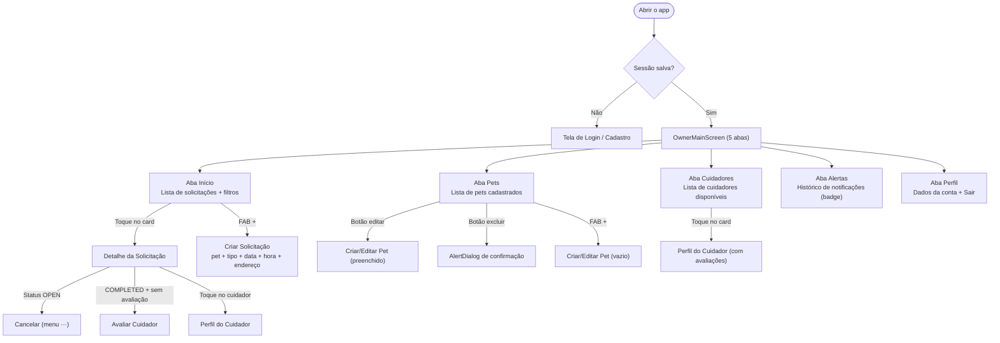
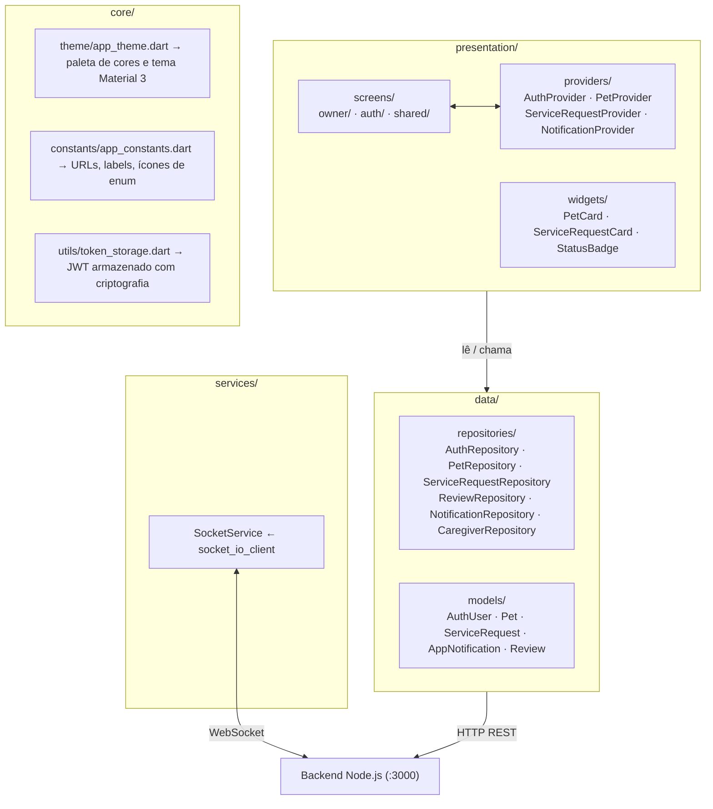
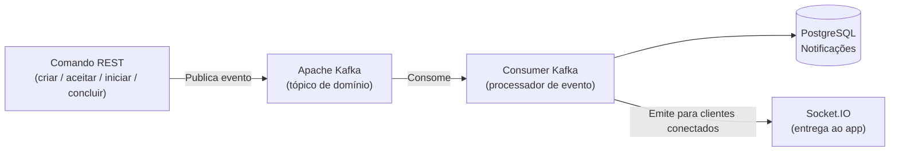
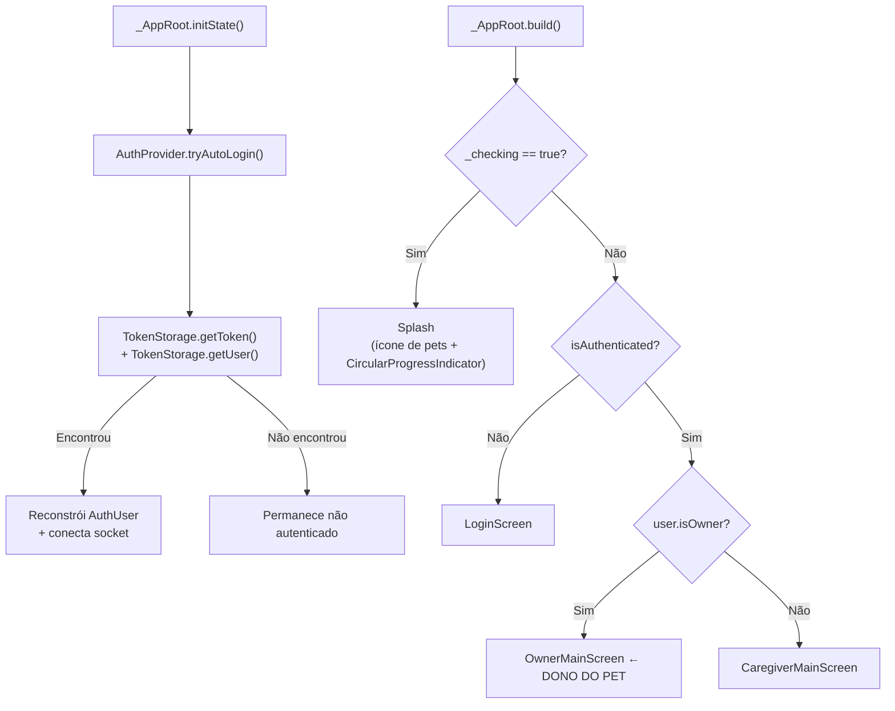
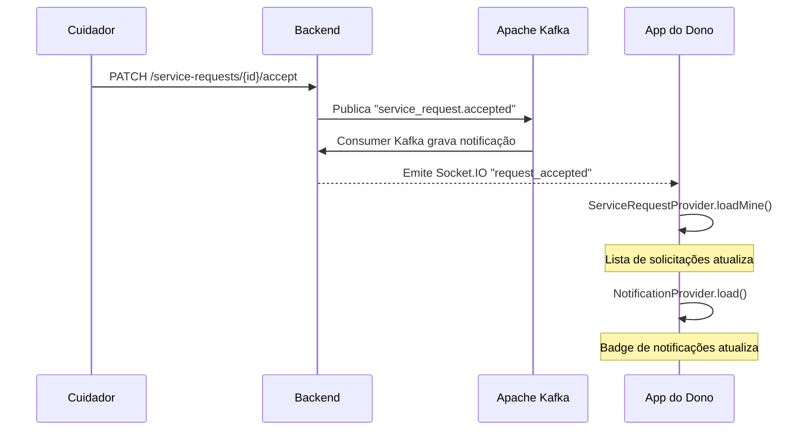

# App Mobile — Perfil: Dono do Pet

> Documentação técnica do **Plantão Pet** sob a perspectiva do **Dono do Pet**. O app Flutter é único — o mesmo binário serve ambos os perfis. Ao fazer login como Dono, o sistema exibe a interface descrita neste documento. O perfil é determinado no momento do cadastro e nunca muda.

---

## Sumário

- [O que é o perfil Dono?](#o-que-é-o-perfil-dono)
- [Fluxo completo do Dono](#fluxo-completo-do-dono)
- [Arquitetura do app](#arquitetura-do-app)
- [Padrões Arquiteturais Aplicados](#padrões-arquiteturais-aplicados)
- [Estrutura de arquivos](#estrutura-de-arquivos)
- [Configuração e execução](#configuração-e-execução)
- [Segurança — JWT e armazenamento](#segurança--jwt-e-armazenamento)
- [Inicialização — como o app decide o que mostrar](#inicialização--como-o-app-decide-o-que-mostrar)
- [Navegação — as 5 abas do Dono](#navegação--as-5-abas-do-dono)
- [Telas detalhadas](#telas-detalhadas)
  - [Login](#login)
  - [Cadastro](#cadastro)
  - [Início (Home)](#início-home)
  - [Criar Solicitação](#criar-solicitação)
  - [Detalhe da Solicitação](#detalhe-da-solicitação)
  - [Perfil do Cuidador (tela compartilhada)](#perfil-do-cuidador-tela-compartilhada)
  - [Avaliação](#avaliação)
  - [Pets](#pets)
  - [Criar / Editar Pet](#criar--editar-pet)
  - [Explorar Cuidadores](#explorar-cuidadores)
  - [Alertas / Notificações](#alertas--notificações)
  - [Perfil do Dono](#perfil-do-dono)
- [Modelos de dados](#modelos-de-dados)
- [Repositórios — acesso à API](#repositórios--acesso-à-api)
- [Providers — gerenciamento de estado](#providers--gerenciamento-de-estado)
- [Serviço de Socket.IO — tempo real](#serviço-de-socketio--tempo-real)
- [Widgets reutilizáveis](#widgets-reutilizáveis)
- [Cores e tema](#cores-e-tema)
- [Dependências](#dependências)

---

## O que é o perfil Dono?

O **Dono do Pet** é o usuário que possui animais de estimação e precisa contratar serviços de cuidado para eles. Ele é quem inicia o ciclo de vida de uma solicitação de serviço. No app, o Dono pode:

- Cadastrar e gerenciar seus pets (espécie, raça, idade, observações de saúde)
- Abrir solicitações de serviço para qualquer pet, definindo tipo de serviço, data, horário e endereço de encontro
- Aguardar que um cuidador aceite — e ser notificado em tempo real assim que isso acontecer, sem precisar atualizar a tela
- Acompanhar cada etapa do serviço: criado → aceito → em andamento → concluído
- Cancelar uma solicitação que ainda não foi aceita
- Explorar o perfil público de qualquer cuidador cadastrado no sistema
- Avaliar o cuidador com nota (1–5 estrelas) e comentário após o serviço ser concluído
- Ver o histórico de notificações recebidas

O Dono **não pode** aceitar solicitações, controlar disponibilidade, nem ver filas de trabalho — essas são funções exclusivas do perfil Cuidador.

---

## Fluxo completo do Dono



---

## Arquitetura do app

O app segue **Clean Architecture** — cada camada conhece apenas a camada imediatamente abaixo, nunca acima:



**Gerenciamento de estado:** `provider` (`ChangeNotifier`). Quatro providers independentes, cada um responsável por um domínio.

**Comunicação REST:** pacote `http`. Cada repositório encapsula as chamadas de um domínio e lança `Exception` em caso de erro HTTP; o provider captura e expõe no campo `error`.

---

## Padrões Arquiteturais Aplicados

### Clean Architecture

O app segue **Clean Architecture** (MARTIN, 2019), com regra de dependência unidirecional: camadas externas conhecem as internas, nunca o contrário. Nenhum widget conhece URLs ou parsing JSON; nenhum repositório conhece a existência de telas.

| Camada | Artefatos | Responsabilidade |
|---|---|---|
| `presentation/` | Screens, Providers, Widgets | Renderizar estado e capturar ações do usuário |
| `data/` | Repositories, Models | Acessar a API REST, serializar/deserializar JSON |
| `services/` | SocketService | Manter conexão WebSocket e despachar eventos |
| `core/` | AppTheme, AppConstants, TokenStorage | Configurações e utilitários transversais |

O `SocketService` é criado em `main.dart` e injetado nos providers via construtor — tornando cada componente testável de forma isolada.

### Arquitetura Orientada a Eventos (EDA) e MOM

O sistema adota **Event-Driven Architecture** (HOHPE; WOOLF, 2003), com o **Apache Kafka** como Middleware Orientado a Mensagens (MOM). Toda transição de estado — criação, aceite, início e conclusão de serviço — é publicada como evento em um tópico Kafka. Um consumer independente consome esses eventos, persiste notificações no banco e entrega atualizações em tempo real via Socket.IO.



**Benefícios no Plantão Pet:**
- A lógica de negócio não conhece os destinatários das notificações — apenas publica eventos
- Novos consumidores (push notifications, e-mail) podem ser adicionados sem alterar os serviços existentes
- O Kafka persiste eventos mesmo que o consumer esteja temporariamente indisponível

### REST como protocolo de comando

As chamadas HTTP REST são usadas exclusivamente para **comandos** — ações que alteram estado no servidor. A **leitura assíncrona de atualizações** ocorre via Socket.IO, garantindo que o Dono veja mudanças de status (aceito, em andamento, concluído) em tempo real, sem nenhuma ação manual de atualização.

---

## Estrutura de arquivos

```
mobile/lib/
├── main.dart                                       ← ponto de entrada
│
├── core/
│   ├── constants/app_constants.dart               ← URLs, labels, ícones
│   ├── theme/app_theme.dart                       ← cores e tema
│   └── utils/token_storage.dart                  ← JWT seguro
│
├── data/
│   ├── models/
│   │   ├── auth_model.dart                        ← AuthUser
│   │   ├── pet_model.dart                         ← Pet
│   │   ├── service_request_model.dart             ← ServiceRequest + aninhados
│   │   ├── notification_model.dart                ← AppNotification
│   │   └── review_model.dart                      ← Review
│   └── repositories/
│       ├── auth_repository.dart
│       ├── pet_repository.dart
│       ├── service_request_repository.dart
│       ├── review_repository.dart
│       ├── notification_repository.dart
│       └── caregiver_repository.dart              ← inclui CaregiverSummary
│
├── presentation/
│   ├── providers/
│   │   ├── auth_provider.dart
│   │   ├── pet_provider.dart
│   │   ├── service_request_provider.dart
│   │   └── notification_provider.dart
│   ├── screens/
│   │   ├── auth/
│   │   │   ├── login_screen.dart                 ← Login (dono e cuidador)
│   │   │   └── register_screen.dart              ← Cadastro (dono e cuidador)
│   │   ├── owner/                                ← TELAS EXCLUSIVAS DO DONO
│   │   │   ├── owner_main_screen.dart            ← shell com 5 abas
│   │   │   ├── owner_home_screen.dart            ← lista de solicitações
│   │   │   ├── create_service_request_screen.dart
│   │   │   ├── service_request_detail_screen.dart
│   │   │   ├── pets_screen.dart
│   │   │   ├── create_pet_screen.dart
│   │   │   ├── caregivers_screen.dart            ← browse de cuidadores
│   │   │   ├── review_screen.dart
│   │   │   ├── owner_notifications_screen.dart
│   │   │   └── owner_profile_screen.dart
│   │   └── shared/
│   │       └── caregiver_detail_screen.dart      ← perfil público de cuidador
│   └── widgets/
│       ├── pet_card.dart
│       ├── service_request_card.dart
│       └── status_badge.dart
│
└── services/
    └── socket_service.dart
```

---

## Configuração e execução

### Pré-requisitos

- Flutter SDK 3.3.0+
- Xcode (para iOS) ou Android Studio (para Android)
- Backend Plantão Pet rodando — ver [docs/backend-api.md](backend-api.md)

### Variáveis de ambiente

As URLs da API são injetadas em **tempo de compilação** com `--dart-define-from-file`. Nunca ficam hardcoded no código.

```bash
cd mobile
cp .env.example .env
```

Edite `.env`:
```env
# iOS Simulator (padrão)
BASE_URL=http://localhost:3000
SOCKET_URL=http://localhost:3000

# Android Emulator (troque se for rodar no Android)
# BASE_URL=http://10.0.2.2:3000
# SOCKET_URL=http://10.0.2.2:3000
```

### Executar

```bash
cd mobile
flutter pub get
flutter run --dart-define-from-file=.env
```

Para especificar um simulador (ver a seção de dois simuladores no README):
```bash
flutter run -d "iPhone 17" --dart-define-from-file=.env
```

---

## Segurança — JWT e armazenamento

### TokenStorage (`core/utils/token_storage.dart`)

Toda credencial é armazenada com **`flutter_secure_storage`** — nunca em `SharedPreferences` comum:

| Dado salvo | Chave | Mecanismo no iOS | Mecanismo no Android |
|---|---|---|---|
| JWT | `jwt_token` | Keychain (`first_unlock`) | `EncryptedSharedPreferences` |
| Dados do usuário (JSON) | `user_data` | Keychain | `EncryptedSharedPreferences` |

**`TokenStorage.decodeToken(token)`** — extrai o payload do JWT sem verificar assinatura. Divide por `.`, decodifica o segmento do meio com base64Url e faz `jsonDecode`. Usado logo após o login para obter o `id` do usuário e fazer a segunda chamada de perfil.

### URLs como variáveis de compilação

```dart
static const String baseUrl = String.fromEnvironment(
  'BASE_URL',
  defaultValue: 'http://localhost:3000',
);
```

---

## Inicialização — como o app decide o que mostrar

**Arquivo:** `main.dart`

O `main()` inicializa os dados de localização pt_BR antes de rodar o app:
```dart
void main() async {
  WidgetsFlutterBinding.ensureInitialized();
  await initializeDateFormatting('pt_BR');
  runApp(const PlantaoPetApp());
}
```

O `PlantaoPetApp` cria uma instância única de `SocketService` e monta o `MultiProvider`:

```dart
final socket = SocketService();
MultiProvider(providers: [
  ChangeNotifierProvider(create: (_) => AuthProvider(AuthRepository(), socket)),
  ChangeNotifierProvider(create: (_) => PetProvider(PetRepository())),
  ChangeNotifierProvider(create: (_) => ServiceRequestProvider(ServiceRequestRepository(), socket)),
  ChangeNotifierProvider(create: (_) => NotificationProvider(NotificationRepository(), socket)),
], child: MaterialApp(home: const _AppRoot()))
```

O widget `_AppRoot` tenta o auto-login no `initState` e exibe um splash enquanto verifica:



---

## Navegação — as 5 abas do Dono

**Arquivo:** `owner_main_screen.dart`

`OwnerMainScreen` usa `IndexedStack` + `BottomNavigationBar`. Com `IndexedStack`, as telas são mantidas em memória ao trocar de aba — o estado não é perdido.

No `initState` (via `addPostFrameCallback` para garantir que o contexto está pronto):
1. `srProvider.loadMine(token)` — carrega as solicitações do dono
2. `srProvider.listenToSocket(token)` — registra listeners de Socket.IO
3. `notifProvider.load(token)` — carrega o histórico de notificações
4. `notifProvider.listenToSocket(token)` — registra listeners de notificação

| Índice | Ícone | Label | Tela | Observação |
|---|---|---|---|---|
| 0 | `Icons.home` | Início | `OwnerHomeScreen` | Lista de solicitações + FAB para criar |
| 1 | `Icons.pets` | Pets | `PetsScreen` | Gerenciar pets + FAB para adicionar |
| 2 | `Icons.people` | Cuidadores | `CaregiversScreen` | Browse de cuidadores disponíveis |
| 3 | `Icons.notifications` | Alertas | `OwnerNotificationsScreen` | Badge vermelho com `unreadCount` |
| 4 | `Icons.person` | Perfil | `OwnerProfileScreen` | Dados + logout |

O badge da aba Alertas lê `NotificationProvider.unreadCount` reativamente.

---

## Telas detalhadas

### Login

**Arquivo:** `screens/auth/login_screen.dart`

Tela única para ambos os perfis. O usuário escolhe o tipo de conta antes de digitar e-mail e senha.

**Componentes:**
- `_Header`: área com gradiente roxo-claro, ícone de pets, logo "Plantão**Pet**" em azul e tagline
- `RoleToggle`: dois botões lado a lado ("Dono do Pet" com `Icons.favorite_border` e "Cuidador" com `Icons.star_border`). O selecionado recebe borda azul e fundo branco
- Campo e-mail com validação `contains('@')`
- Campo senha com toggle de visibilidade
- Botão "Esqueci minha senha" — presente na UI mas sem ação implementada
- Botão "Entrar" — desabilitado durante loading (exibe `CircularProgressIndicator`)
- Separador "ou" + botão "Criar conta" → abre `RegisterScreen` com o perfil já selecionado

**Fluxo de login do Dono:**
1. `_isOwner == true` → chama `AuthProvider.loginOwner(email, senha)`
2. Provider chama `AuthRepository.loginOwner()` → `POST /auth/owner/login`
3. Extrai token da resposta, decodifica com `TokenStorage.decodeToken()` para pegar `id`
4. Faz segunda chamada: `GET /owners/{id}` para buscar dados completos do perfil
5. Salva token e usuário no `TokenStorage`
6. Conecta `SocketService` com o token
7. `_AppRoot` detecta mudança no `AuthProvider` e exibe `OwnerMainScreen`

---

### Cadastro

**Arquivo:** `screens/auth/register_screen.dart`

Tela única para ambos os perfis — a seleção do perfil determina quais campos aparecem.

**Campos para o Dono do Pet:**

| Campo | Validação | Observação |
|---|---|---|
| Tipo de perfil | Obrigatório | `RoleToggle` reaproveitado do Login |
| Nome completo | Mínimo 2 caracteres | — |
| Email | Deve conter `@` | — |
| Telefone | Mínimo 10 dígitos (ignora não-dígitos) | Stripado com `replaceAll(RegExp(r'\D'), '')` antes de enviar |
| Endereço | Mínimo 5 caracteres | Campo exclusivo do Dono |
| Senha | Mínimo 6 caracteres | Toggle de visibilidade |

Ao submeter:
1. Valida o formulário
2. Chama `AuthProvider.registerOwner({name, email, phone, address, password})`
3. Provider chama `AuthRepository.registerOwner()` → `POST /auth/owner/register`
4. A resposta já inclui o token — não é necessária segunda chamada
5. Salva token e usuário, conecta socket
6. `Navigator.popUntil(isFirst)` → `_AppRoot` detecta autenticação e exibe `OwnerMainScreen`

---

### Início (Home)

**Arquivo:** `screens/owner/owner_home_screen.dart`

Tela principal do Dono. Lista todas as suas solicitações de serviço.

**Layout:**
- `_Header`: fundo branco, saudação "Olá, {primeiro nome}!" + data atual formatada em pt_BR (ex: "quinta-feira, 19 de junho")
  - Avatar circular azul com iniciais do usuário (ex: "JS")
- Contador "N no total" e filtros horizontais
- `SliverList` com `ServiceRequestCard` para cada solicitação filtrada

**Filtros (chips horizontais scrolláveis):**

| Chip | Status filtrado |
|---|---|
| Todas | nenhum (exibe todas) |
| Em andamento | `IN_PROGRESS` |
| Abertas | `OPEN` |

**Pull to refresh:** chama `srProvider.loadMine(auth.user!.token)`.

**Estado vazio:** ícone de pets cinza + mensagem contextual (muda se há filtro ativo).

**FAB** (`heroTag: 'fab_home'`): abre `CreateServiceRequestScreen`. O `heroTag` personalizado evita conflito com o FAB da tela de Pets.

---

### Criar Solicitação

**Arquivo:** `screens/owner/create_service_request_screen.dart`

Formulário dividido em seções (`_SectionCard` com ícone + título uppercase + conteúdo).

**Seção 1 — SELECIONAR PET:**
- Carrega os pets do dono via `PetProvider.load()` no `initState`
- Exibe scroll horizontal de cards de 90px. Cada card tem: ícone da espécie no fundo colorido + nome do pet
- Pet selecionado recebe borda azul de 2px + fundo `primaryLight`
- Se não há pets: texto "Cadastre um pet antes de criar uma solicitação"

**Seção 2 — TIPO DE SERVIÇO:**
Grid 2×2 de opções:

| Código | Linha 1 | Linha 2 | Ícone |
|---|---|---|---|
| `WALK_30MIN` | Passeio | 30 min | `Icons.directions_walk` |
| `WALK_1H` | Passeio | 1 hora | `Icons.directions_walk` |
| `HOME_VISIT` | Visita | Domiciliar | `Icons.home_outlined` |
| `HOSTING` | Hospedagem | Temporária | `Icons.bed_outlined` |

**Seção 3 — DATA E HORÁRIO:**
- Dois campos lado a lado: Data (DatePicker) e Horário (TimePicker)
- DatePicker: mínimo = agora + 2h, máximo = agora + 90 dias

**Seção 4 — ENDEREÇO DE ATENDIMENTO:**
- Campo de texto com ícone de localização
- Validação: mínimo 5 caracteres

**Banner de aviso:** fundo amarelo claro com texto "O agendamento deve ser feito com pelo menos **2 horas de antecedência**. A solicitação expira automaticamente em 24h se não aceita."

**Validação extra no submit:** verifica se `scheduledAt` está no futuro com pelo menos 2h antes de enviar à API.

**Ao submeter com sucesso:** SnackBar verde "Solicitação criada com sucesso!" → `Navigator.pop()`. A nova solicitação é adicionada ao início de `_requests` no provider.

---

### Detalhe da Solicitação

**Arquivo:** `screens/owner/service_request_detail_screen.dart`

Tela reativa — assina `ServiceRequestProvider` e encontra o estado atualizado da solicitação via `requests.firstWhere(r.id == _request.id, orElse: () => _request)`. Quando um evento Socket.IO chega e o provider recarrega, esta tela atualiza automaticamente.

**Card principal:**
- Ícone da espécie (52×52, fundo colorido com opacidade 12%) + nome do pet + tipo de serviço + `StatusBadge`
- Data formatada `dd/MM/yyyy`, horário `HH:mm` (convertidos para horário local com `.toLocal()`)
- Endereço de encontro

**Banner Em Andamento** (aparece somente quando `status == 'IN_PROGRESS'` e `caregiver != null`):
- Fundo verde claro, borda verde: `"[pet.name] está em passeio agora com [caregiver.name]"`

**Card do cuidador** (aparece quando `caregiver != null`):
- Avatar quadrado azul com iniciais do cuidador
- Nome e telefone
- Toque no card → `CaregiverDetailScreen(caregiverId, caregiverName)` (tela de perfil público)

**Timeline de progresso (`_ProgressTimeline`):**
4 etapas verticais com círculos conectados por linhas. Círculo verde = concluído, cinza = pendente:

| Etapa | Condição para marcar como concluída |
|---|---|
| Solicitação criada | Sempre (data/hora do `createdAt`) |
| Solicitação aceita | `caregiver != null` |
| Serviço iniciado | `status == 'IN_PROGRESS'` ou `status == 'COMPLETED'` |
| Serviço concluído | `status == 'COMPLETED'` |

**Menu ···** (AppBar, `PopupMenuButton`): "Cancelar solicitação" — só aparece quando `status == 'OPEN'`. Exibe `AlertDialog` de confirmação, chama `ServiceRequestProvider.cancel()`, e ao confirmar faz `Navigator.pop()`.

**Botão "Avaliar Cuidador"** — aparece quando `status == 'COMPLETED'` **e** `review == null`. Abre `ReviewScreen`.

**Card de avaliação** — aparece quando `review != null`. Fundo amarelo claro, estrelas (preenchidas ou vazias), comentário em texto.

---

### Perfil do Cuidador (tela compartilhada)

**Arquivo:** `screens/shared/caregiver_detail_screen.dart`

Aberta em dois contextos:
1. Do `ServiceRequestDetailScreen` ao tocar no card do cuidador
2. Da `CaregiversScreen` ao tocar em um card da listagem

No `initState`, carrega em paralelo com `Future.wait`:
```dart
final results = await Future.wait([
  _repo.getById(caregiverId, token),    // GET /caregivers/:id
  _repo.getReviews(caregiverId, token), // GET /caregivers/:id/reviews
]);
```

**Layout:**
- Avatar circular azul com iniciais (80×80)
- Nome, média de estrelas + total de avaliações
- Badge "Disponível" (verde) ou "Indisponível" (cinza) — baseado em `status == 'ACTIVE'`

**Seção INFORMAÇÕES:** telefone + bairros atendidos

**Seção SERVIÇOS OFERECIDOS:** chips azuis com label traduzido (usa `AppConstants.serviceTypeLabels`)

**Seção AVALIAÇÕES:** lista de `_ReviewTile` — cada um exibe estrelas, data, comentário e divisor

---

### Avaliação

**Arquivo:** `screens/owner/review_screen.dart`

Acessível somente a partir do `ServiceRequestDetailScreen` quando `status == 'COMPLETED'` e ainda não há avaliação.

**Layout:**
- Avatar quadrado azul com iniciais do cuidador (80×80)
- Nome do cuidador + nome do pet
- Seletor de estrelas: 5 ícones `Icons.star` / `Icons.star_border` tocáveis. Rating padrão = 5
- Campo de comentário multi-linha (obrigatório)
- Botão "Enviar Avaliação" — desabilitado durante loading

**Implementação:** `ReviewScreen` instancia `ReviewRepository()` diretamente (sem provider). Envia:
```
POST /reviews  { serviceRequestId, caregiverId, rating, comment }
```

**Ao submeter com sucesso:** SnackBar verde → `Navigator.pop()` × 2 (fecha a avaliação e fecha o detalhe da solicitação, voltando à Home).

---

### Pets

**Arquivo:** `screens/owner/pets_screen.dart`

`PetsScreen` carrega os pets no `initState` via `PetProvider.load()`. Após uma edição ou exclusão, chama `_load()` novamente via `.then((_) => _load())` no callback do `Navigator.push`.

**Cabeçalho:**
- Título "Meus Pets" + subtítulo "Gerencie seus animais cadastrados"
- Badge azul no canto superior direito com o total de pets

**Lista:**
- Um `PetCard` para cada pet
- Após todos os pets: card informativo "Adicionar mais pets pelo botão +" (em fundo azul claro)
- Estado vazio: ícone cinza + link "Adicionar pet"

**FAB** (`heroTag: 'fab_pets'`): abre `CreatePetScreen` (modo criação).

**Exclusão:** `AlertDialog` de confirmação com o nome do pet. Chama `PetProvider.delete()`.

---

### Criar / Editar Pet

**Arquivo:** `screens/owner/create_pet_screen.dart`

Tela reutilizável. O comportamento muda com base no parâmetro `Pet? pet`:

| `pet` | Modo | Título da AppBar | Texto do botão |
|---|---|---|---|
| `null` | Criação | "Novo Pet" | "Cadastrar Pet" |
| `Pet` preenchido | Edição | "Editar Pet" | "Salvar alterações" |

No modo edição, os controllers são pré-preenchidos com os dados do pet existente.

**Seletor de espécie:**
3 cards horizontais. Cada um tem: círculo com ícone no topo + label. O selecionado recebe borda azul 2px + fundo `primaryLight`. Cor do ícone muda conforme a espécie:
- DOG → azul `AppColors.primary`
- CAT → roxo `AppColors.speciesCat`
- OTHER → cinza `AppColors.textSecondary`

**Campos:**

| Campo | Hint | Validação |
|---|---|---|
| NOME DO PET | "Ex: Rex, Luna" | Obrigatório (não vazio) |
| RAÇA | "Ex: Golden Retriever" | Obrigatório |
| IDADE (anos) | "Ex: 3" | Obrigatório, 0–30, inteiro |
| OBSERVAÇÕES ESPECIAIS | "Alergias, medicamentos..." | Opcional |

**Tratamento de `specialNotes`:**
- Campo vazio → `notes = null`
- Na criação: `specialNotes` é **omitido** do JSON quando null (Dart collection-if)
- Na edição: envia `specialNotes: ""` quando null/vazio (o backend normaliza `""` para `null`)

---

### Explorar Cuidadores

**Arquivo:** `screens/owner/caregivers_screen.dart`

Lista todos os cuidadores retornados por `GET /caregivers`. Não usa um provider — instancia `CaregiverRepository()` diretamente com estado local (`setState`).

**Card do cuidador (`_CaregiverCard`):**
- Avatar circular azul claro com iniciais (52×52)
- Nome + média de estrelas (se `averageRating != null`)
- Até 2 bairros (com `c.neighborhoods.take(2)`)
- Até 2 serviços como chips + "+N" se houver mais
- Ponto verde (ACTIVE) ou cinza (INACTIVE) no canto direito

**Toque no card:** abre `CaregiverDetailScreen`.

**Botão de atualizar** na AppBar e **pull to refresh** disponíveis.

---

### Alertas / Notificações

**Arquivo:** `screens/owner/owner_notifications_screen.dart`

Exibe o histórico de notificações recebidas pelo dono.

**Eventos que o Dono recebe:**

| `eventType` | Título exibido | Corpo exibido |
|---|---|---|
| `service_request.accepted` | "Solicitação aceita!" | "{caregiverName} aceitou sua solicitação." |
| `service_request.refused` | "Solicitação recusada" | "Sua solicitação voltou para aberta." |
| `service_request.in_progress` | "Serviço iniciado!" | "O cuidador iniciou o serviço." |
| `service.completed` | "Serviço concluído!" | "O serviço foi concluído com sucesso!" |

Notificações não lidas (`readAt == null`) têm fundo diferenciado. Toque em uma notificação chama `NotificationProvider.markRead()` que:
1. Envia `PATCH /notifications/:id/read` para a API
2. Emite evento `mark_read` via Socket.IO
3. Atualiza localmente o `readAt` para `DateTime.now()`

---

### Perfil do Dono

**Arquivo:** `screens/owner/owner_profile_screen.dart`

Tela simples, apenas leitura. Não há edição de dados nesta versão.

**Layout:**
- Avatar circular azul (80×80) com iniciais
- Nome do usuário
- Badge "Dono do Pet" (chip azul claro)
- Seção INFORMAÇÕES PESSOAIS: Email, Telefone, Endereço (se preenchido)

**Logout:**
Botão "Sair da conta" (vermelho) → `AlertDialog` "Tem certeza que deseja sair?" → confirmar chama:
```dart
AuthProvider.logout()
  └── SocketService.disconnect()   ← desconecta o WebSocket
  └── TokenStorage.clear()         ← apaga jwt_token e user_data
  └── _user = null                 ← dispara notifyListeners()
  └── _AppRoot reage               ← exibe LoginScreen
```

---

## Modelos de dados

### `AuthUser` (`data/models/auth_model.dart`)

Representa o usuário autenticado. O mesmo modelo serve Dono e Cuidador.

| Campo | Tipo | Descrição |
|---|---|---|
| `id` | `String` | UUID único do usuário |
| `role` | `String` | `'owner'` para o Dono |
| `name` | `String` | Nome completo |
| `email` | `String` | E-mail de acesso |
| `phone` | `String` | Telefone (somente dígitos) |
| `token` | `String` | JWT Bearer para autenticação nas APIs |
| `address` | `String?` | Endereço do dono (opcional) |
| `neighborhoods` | `List<String>?` | Null para o Dono |
| `services` | `List<String>?` | Null para o Dono |
| `averageRating` | `double?` | Null para o Dono |
| `status` | `String?` | Null para o Dono |

**Getters úteis:**
- `isOwner` → `role == 'owner'`
- `isCaregiver` → `role == 'caregiver'`
- `initials` → primeiras letras do primeiro e segundo nome em maiúsculas (ex: "João Silva" → "JS")

---

### `Pet` (`data/models/pet_model.dart`)

| Campo | Tipo | Descrição |
|---|---|---|
| `id` | `String` | UUID |
| `name` | `String` | Nome (validado como não vazio no app) |
| `species` | `String` | `'DOG'`, `'CAT'` ou `'OTHER'` |
| `breed` | `String` | Raça |
| `age` | `int` | Idade em anos |
| `specialNotes` | `String?` | Observações de saúde/comportamento — pode ser `null` |
| `ownerId` | `String` | UUID do dono proprietário |
| `createdAt` | `DateTime` | Data de cadastro (parse de ISO 8601) |

---

### `ServiceRequest` e classes aninhadas (`data/models/service_request_model.dart`)

**`ServiceRequestPet`** — snapshot do pet no momento do serviço:

| Campo | Tipo |
|---|---|
| `id` | `String` |
| `name` | `String` |
| `species` | `String` |
| `breed` | `String` |

**`ServiceRequestUser`** — snapshot simplificado de um usuário:

| Campo | Tipo |
|---|---|
| `id` | `String` |
| `name` | `String` |
| `phone` | `String` |

Getter `initials` disponível.

**`ServiceRequestReview`** — avaliação associada à solicitação:

| Campo | Tipo |
|---|---|
| `id` | `String` |
| `rating` | `int` (1–5) |
| `comment` | `String` |

**`ServiceRequest`** — modelo principal:

| Campo | Tipo | Descrição |
|---|---|---|
| `id` | `String` | UUID |
| `petId` | `String` | UUID do pet |
| `ownerId` | `String` | UUID do dono |
| `caregiverId` | `String?` | UUID do cuidador (null enquanto OPEN) |
| `serviceType` | `String` | `WALK_30MIN`, `WALK_1H`, `HOME_VISIT` ou `HOSTING` |
| `scheduledAt` | `DateTime` | Data/hora agendada (UTC → `.toLocal()` para exibir) |
| `meetingAddress` | `String` | Endereço de encontro |
| `status` | `String` | `OPEN`, `ACCEPTED`, `IN_PROGRESS`, `COMPLETED`, `CANCELLED` ou `REFUSED` |
| `expiresAt` | `DateTime` | 24h após a criação (para expiração automática) |
| `createdAt` | `DateTime` | Quando foi criada |
| `pet` | `ServiceRequestPet` | Dados do pet |
| `owner` | `ServiceRequestUser` | Dados do dono |
| `caregiver` | `ServiceRequestUser?` | Dados do cuidador (null enquanto OPEN) |
| `review` | `ServiceRequestReview?` | Avaliação (null se não foi feita) |

---

### `AppNotification` (`data/models/notification_model.dart`)

| Campo | Tipo | Descrição |
|---|---|---|
| `id` | `String` | UUID |
| `userId` | `String` | ID do destinatário |
| `userRole` | `String` | `'owner'` ou `'caregiver'` |
| `eventType` | `String` | Tipo do evento Kafka que gerou esta notificação |
| `payload` | `Map<String, dynamic>` | Dados completos do evento |
| `requestId` | `String?` | ID da solicitação relacionada (quando aplicável) |
| `readAt` | `DateTime?` | `null` = não lida |
| `createdAt` | `DateTime` | Data de criação |

**Getters:**
- `isRead` → `readAt != null`
- `title` → texto do título baseado em `eventType` (ex: `service_request.accepted` → "Solicitação aceita!")
- `body` → texto descritivo, podendo usar dados do `payload` (ex: `payload['caregiverName']`)

---

### `Review` (`data/models/review_model.dart`)

Usado pela `CaregiverDetailScreen` para listar avaliações recebidas:

| Campo | Tipo |
|---|---|
| `id` | `String` |
| `serviceRequestId` | `String` |
| `ownerId` | `String` |
| `caregiverId` | `String` |
| `rating` | `int` (1–5) |
| `comment` | `String` |
| `createdAt` | `DateTime` |

---

### `CaregiverSummary` (`data/repositories/caregiver_repository.dart`)

Modelo de cuidador para a listagem e perfil público. Definido no mesmo arquivo do repositório:

| Campo | Tipo |
|---|---|
| `id` | `String` |
| `name` | `String` |
| `email` | `String` |
| `phone` | `String` |
| `neighborhoods` | `List<String>` |
| `services` | `List<String>` |
| `averageRating` | `double?` |
| `totalReviews` | `int?` |
| `status` | `String` (`'ACTIVE'` ou `'INACTIVE'`) |

Getter `initials` disponível.

---

## Repositórios — acesso à API

Todos os repositórios leem `AppConstants.baseUrl` e lançam `Exception` em erro HTTP.

### `AuthRepository`

| Método | HTTP | Endpoint | Descrição |
|---|---|---|---|
| `loginOwner(email, password)` | POST → GET | `/auth/owner/login` → `/owners/{id}` | Faz login (retorna token), decodifica JWT para obter `id`, busca perfil completo |
| `registerOwner({name, email, phone, address, password})` | POST | `/auth/owner/register` | Cadastra dono; resposta inclui token diretamente nos `data` |
| `fetchCaregiverProfile(id, token)` | GET | `/caregivers/{id}` | Busca perfil atualizado (chamado pelo AuthProvider ao abrir aba Perfil do Cuidador) |
| `updateCaregiverStatus(status, token)` | PATCH | `/caregivers/status` | Alterna ACTIVE/INACTIVE (não usado pelo Dono) |
| `loginCaregiver(email, password)` | POST → GET | `/auth/caregiver/login` → `/caregivers/{id}` | Login do Cuidador |
| `registerCaregiver({...})` | POST | `/auth/caregiver/register` | Cadastro do Cuidador |

---

### `PetRepository`

| Método | HTTP | Endpoint | Corpo | Descrição |
|---|---|---|---|---|
| `getPets(ownerId, token)` | GET | `/owners/pets` | — | Lista todos os pets do dono |
| `createPet({ownerId, token, name, species, breed, age, specialNotes?})` | POST | `/owners/pets` | JSON sem `specialNotes` quando null | Cria pet; omite `specialNotes` com collection-if |
| `updatePet({petId, token, name, species, breed, age, specialNotes?})` | PUT | `/owners/pets/{petId}` | Inclui `specialNotes: ""` quando null | Atualiza; backend normaliza `""` → `null` |
| `deletePet({petId, token})` | DELETE | `/owners/pets/{petId}` | — | Espera `204`; outros status lançam Exception |

---

### `ServiceRequestRepository`

| Método | HTTP | Endpoint | Descrição |
|---|---|---|---|
| `getMine(token)` | GET | `/service-requests/my` | Solicitações do dono autenticado |
| `getOpen(token)` | GET | `/service-requests` | Solicitações OPEN (para o Cuidador) |
| `getById(id, token)` | GET | `/service-requests/{id}` | Detalhes completos |
| `create({token, petId, serviceType, scheduledAt, meetingAddress})` | POST | `/service-requests` | `scheduledAt` como ISO 8601 UTC |
| `cancel(id, token)` | PATCH | `/service-requests/{id}/cancel` | Apenas quando OPEN |
| `accept(id, token)` | PATCH | `/service-requests/{id}/accept` | Cuidador aceita |
| `refuse(id, token)` | PATCH | `/service-requests/{id}/refuse` | Cuidador recusa |
| `start(id, token)` | PATCH | `/service-requests/{id}/start` | Cuidador inicia |
| `complete(id, token)` | PATCH | `/service-requests/{id}/complete` | Cuidador conclui |

---

### `ReviewRepository`

| Método | HTTP | Endpoint | Corpo | Descrição |
|---|---|---|---|---|
| `create({token, serviceRequestId, caregiverId, rating, comment})` | POST | `/reviews` | JSON completo | Cria avaliação; resposta `201` |

---

### `NotificationRepository`

| Método | HTTP | Endpoint | Descrição |
|---|---|---|---|
| `getAll(token)` | GET | `/notifications` | Histórico completo |
| `markRead(id, token)` | PATCH | `/notifications/{id}/read` | Marca como lida |

---

### `CaregiverRepository`

| Método | HTTP | Endpoint | Retorno |
|---|---|---|---|
| `getAll(token)` | GET | `/caregivers` | `List<CaregiverSummary>` |
| `getById(id, token)` | GET | `/caregivers/{id}` | `CaregiverSummary` |
| `getReviews(id, token)` | GET | `/caregivers/{id}/reviews` | `List<Review>` |

---

## Providers — gerenciamento de estado

Todos os providers estendem `ChangeNotifier`. Campos com `_` são privados e expostos via getters.

### `AuthProvider`

| Campo | Tipo | Getter público | Descrição |
|---|---|---|---|
| `_user` | `AuthUser?` | `user` | Usuário autenticado |
| `_loading` | `bool` | `loading` | Operação em andamento |
| `_error` | `String?` | `error` | Último erro (sem prefixo "Exception: ") |
| — | — | `isAuthenticated` | `_user != null` |

**Métodos:**

| Método | Ação |
|---|---|
| `tryAutoLogin()` | Lê `TokenStorage`, reconstrói `AuthUser`, conecta socket |
| `loginOwner(email, password)` | `POST login` → salva → conecta socket → retorna `bool` |
| `loginCaregiver(email, password)` | Idem para cuidador |
| `registerOwner({...})` | `POST register` → salva → conecta socket → retorna `bool` |
| `registerCaregiver({...})` | Idem para cuidador |
| `refreshProfile()` | Busca perfil atualizado do cuidador (para `averageRating`). No-op para dono |
| `updateCaregiverStatus(status)` | Alterna ACTIVE/INACTIVE sem fazer nova requisição de perfil |
| `logout()` | Desconecta socket → limpa storage → `_user = null` |
| `clearError()` | Zera `_error` |

---

### `PetProvider`

| Campo | Getter | Descrição |
|---|---|---|
| `_pets` | `pets` | Lista de pets do dono |
| `_loading` | `loading` | — |
| `_error` | `error` | — |

**Atualizações otimistas:** a lista local é modificada imediatamente, sem esperar confirmação da UI.

| Método | Atualização local |
|---|---|
| `load(ownerId, token)` | Substitui `_pets` inteiro |
| `create({...})` | `_pets = [novoPet, ..._pets]` (insere no topo) |
| `update({...})` | `_pets.map(p => p.id == petId ? updated : p)` |
| `delete({petId, token})` | `_pets.where(p => p.id != petId)` |
| `clearError()` | Zera `_error` |

---

### `ServiceRequestProvider`

| Campo | Getter | Descrição |
|---|---|---|
| `_requests` | `requests` | Solicitações do usuário autenticado (dono: suas; cuidador: aceitas) |
| `_openRequests` | `openRequests` | Solicitações OPEN (usado pelo Cuidador) |
| `_loading` | `loading` | — |
| `_error` | `error` | — |

**Listeners de Socket.IO** (registrados em `listenToSocket(token)`):

| Evento | Reação |
|---|---|
| `new_request` | `loadOpen(token)` — nova solicitação disponível para o Cuidador |
| `request_accepted` | `loadMine(token)` — atualiza lista do Dono |
| `request_refused` | `loadMine(token)` |
| `service_started` | `loadMine(token)` |
| `service_completed` | `loadMine(token)` |

O mesmo provider lida com eventos de ambos os perfis. O que é chamado depende do contexto:
- Dono → `listenToSocket` registra os 5 eventos, mas só `request_*` e `service_*` são relevantes
- Cuidador → registra os mesmos, mas só `new_request` é relevante para a home dele

**Métodos:**

| Método | Comportamento |
|---|---|
| `loadMine(token)` | Carrega com loading = true/false |
| `loadOpen(token)` | Idem para lista de abertas |
| `create({...})` | `_requests = [nova, ..._requests]` ao criar |
| `accept(id, token)` | Remove de `_openRequests`, adiciona/atualiza em `_requests` |
| `refuse(id, token)` | Remove de `_openRequests` |
| `cancel(id, token)` | Atualiza status em `_requests` via `_updateInMine()` |
| `start(id, token)` | Idem |
| `complete(id, token)` | Idem |

`_updateInMine(updated)`: encontra pelo `id` em `_requests` e substitui; se não encontrar, insere no topo.

---

### `NotificationProvider`

| Campo | Getter | Descrição |
|---|---|---|
| `_notifications` | `notifications` | Lista de todas as notificações |
| `_loading` | `loading` | — |
| — | `unreadCount` | `_notifications.where(n => !n.isRead).length` |

**Listeners:** registra os mesmos 6 eventos do socket e chama `load(token)` em qualquer um deles.

| Método | Ação |
|---|---|
| `load(token)` | Busca `GET /notifications` |
| `markRead(id, token)` | `PATCH /notifications/:id/read` + emite `mark_read` no socket + atualiza `readAt` localmente |
| `listenToSocket(token)` | Registra listeners para os 6 eventos |

---

## Serviço de Socket.IO — tempo real

**Arquivo:** `services/socket_service.dart`

Instância única criada em `main.dart` e passada para `AuthProvider`, `ServiceRequestProvider` e `NotificationProvider`.

**Conexão:**
```dart
_socket = io.io(
  AppConstants.socketUrl,
  io.OptionBuilder()
    .setTransports(['websocket'])
    .setQuery({'token': token})  // token passado como query param
    .disableAutoConnect()
    .build(),
);
_socket!.connect();
```

**Eventos que o SocketService pré-registra ao conectar:**
```dart
final events = [
  'new_request', 'request_accepted', 'request_refused',
  'service_started', 'service_completed', 'new_review',
];
```
Cada evento dispara todos os callbacks registrados via `_listeners[event]`.

**API pública:**

| Método | Descrição |
|---|---|
| `connect(token)` | Desconecta anterior (se houver) e abre nova conexão com o token |
| `on(event, callback)` | Registra um listener (acumula — vários callbacks por evento são suportados) |
| `off(event, callback)` | Remove um listener específico |
| `markRead(notificationId)` | Emite evento `mark_read` para o servidor |
| `disconnect()` | `_socket.dispose()` + limpa `_listeners` |
| `isConnected` | `_socket?.connected ?? false` |

**Fluxo Socket.IO para o Dono (exemplo: cuidador aceita):**


O Dono vê o status mudar de "Aberta" para "Aceita" **sem tocar em nada**.

---

## Widgets reutilizáveis

### `StatusBadge` (`widgets/status_badge.dart`)

Chip colorido com texto e fundo por status. Para `IN_PROGRESS`, exibe um ponto pulsante (círculo de 7px) à esquerda do texto.

| Status | Texto | Cor do texto | Fundo |
|---|---|---|---|
| `OPEN` | Aberta | `#F59E0B` (âmbar) | `#FEF3C7` |
| `ACCEPTED` | Aceita | `#3B82F6` (azul) | `#DBEAFE` |
| `IN_PROGRESS` | Em andamento | `#10B981` (verde) | `#D1FAE5` |
| `COMPLETED` | Concluída | `#6B7280` (cinza) | `#F3F4F6` |
| `CANCELLED` | Cancelada | `#EF4444` (vermelho) | `#FEE2E2` |
| `REFUSED` | Recusada | `#F97316` (laranja) | `#FFF7ED` |

---

### `PetCard` (`widgets/pet_card.dart`)

Card de listagem para pets. Estrutura:
- Avatar quadrado (60×60) com ícone da espécie no fundo colorido (opacidade 12%)
- Nome do pet (negrito)
- Raça + idade (ex: "Golden Retriever · 3 anos" ou "1 ano" no singular)
- `_SpeciesChip`: chip colorido com label da espécie (`AppConstants.speciesLabels`)
- `_NoteChip`: chip cinza com o texto de `specialNotes` (truncado se longo) — só aparece quando `specialNotes != null && isNotEmpty`
- Botões de ação: `Icons.edit_outlined` (azul) e `Icons.delete_outline` (vermelho)

---

### `ServiceRequestCard` (`widgets/service_request_card.dart`)

Card de listagem para solicitações.

- Ícone da espécie (44×44, fundo colorido)
- Nome do pet + tipo de serviço traduzido
- `StatusBadge` no canto superior direito
- Quando `caregiver != null`: mini-avatar circular azul (20×20) com inicial + nome do cuidador em azul
- Data formatada em pt_BR (`dd MMM, yyyy`) e horário (`HH:mm`)
- Quando `highlighted == true` (solicitações `IN_PROGRESS`): borda verde de 2px em vez da borda cinza padrão

---

## Cores e tema

**Arquivo:** `core/theme/app_theme.dart` — Material 3 com `useMaterial3: true`, fonte Roboto.

### Cores principais

| Constante | Hex | Uso |
|---|---|---|
| `primary` | `#2D5BE3` | Botões, FAB, bordas ativas, avatares, texto de links |
| `primaryLight` | `#E8EEFF` | Fundo de chips selecionados, badges azuis |
| `background` | `#F5F6FA` | Fundo das telas (cinza muito claro) |
| `surface` | `white` | Cards, AppBar, campos de input |
| `inputBorder` | `#E5E7EB` | Borda padrão dos campos |
| `textPrimary` | `#1A1A2E` | Texto principal (azul muito escuro) |
| `textSecondary` | `#6B7280` | Labels, subtítulos, ícones desabilitados |
| `textHint` | `#9CA3AF` | Placeholder dos campos |
| `divider` | `#E5E7EB` | Divisores, bordas de cards |
| `error` | `#EF4444` | Erros, snackbars de falha, botão de deletar |
| `success` | `#10B981` | Status em andamento, banner verde |
| `successLight` | `#D1FAE5` | Fundo do banner em andamento |
| `warning` | `#F59E0B` | Badge Aberta, aviso de 2h |
| `ratingColor` | `#F59E0B` | Estrelas de avaliação |
| `speciesCat` | `#8B5CF6` | Cor temática do gato (roxo) |

### Status badges

| Status | Cor texto | Cor fundo |
|---|---|---|
| OPEN | `#F59E0B` | `#FEF3C7` |
| ACCEPTED | `#3B82F6` | `#DBEAFE` |
| IN_PROGRESS | `#10B981` | `#D1FAE5` |
| COMPLETED | `#6B7280` | `#F3F4F6` |
| CANCELLED | `#EF4444` | `#FEE2E2` |
| REFUSED | `#F97316` | `#FFF7ED` |

### `AppConstants` — mapeamentos

```dart
serviceTypeLabels: {
  'WALK_30MIN': 'Passeio 30min',
  'WALK_1H': 'Passeio 1h',
  'HOME_VISIT': 'Visita Domiciliar',
  'HOSTING': 'Hospedagem',
}

speciesLabels: {
  'DOG': 'Cão',
  'CAT': 'Gato',
  'OTHER': 'Outro',
}

statusLabels: {
  'OPEN': 'Aberta',
  'ACCEPTED': 'Aceita',
  'IN_PROGRESS': 'Em andamento',
  'COMPLETED': 'Concluída',
  'CANCELLED': 'Cancelada',
  'REFUSED': 'Recusada',
}
```

**`speciesIconWidget(species, size, color)`:** Retorna um `Widget`.
- `'DOG'` → `Icon(Icons.pets, ...)`
- `'CAT'` → `Center(child: FaIcon(FontAwesomeIcons.cat, ...))` — o `Center` é necessário porque o `FaIcon` não se centraliza automaticamente como o `Icon` do Material
- `'OTHER'` → `Icon(Icons.help_outline, ...)`

**`speciesColor(species)`:** Retorna `Color`.
- `'DOG'` → `AppColors.primary` (azul)
- `'CAT'` → `AppColors.speciesCat` (roxo)
- `'OTHER'` → `AppColors.textSecondary` (cinza)

---

## Dependências

**Arquivo:** `mobile/pubspec.yaml`

| Pacote | Versão | Finalidade |
|---|---|---|
| `provider` | `^6.1.2` | Gerenciamento de estado com `ChangeNotifier` |
| `http` | `^1.2.1` | Chamadas HTTP REST |
| `flutter_secure_storage` | `^9.2.4` | JWT no Keychain (iOS) / EncryptedSharedPreferences (Android) |
| `socket_io_client` | `^2.0.3+1` | WebSocket para notificações em tempo real |
| `intl` | `^0.19.0` | Formatação de datas em pt_BR |
| `font_awesome_flutter` | `^11.0.0` | Ícone do gato (`FontAwesomeIcons.cat`) |
| `cupertino_icons` | `^1.0.6` | Ícones iOS |
| `flutter_lints` | `^4.0.0` | Regras de lint estático (dev) |

---

<div align="center">
  
</div>
<p align="center">Fonte do banner: <a href="https://github.com/joaopauloaramuni">João Paulo Carneiro Aramuni</a></p>
